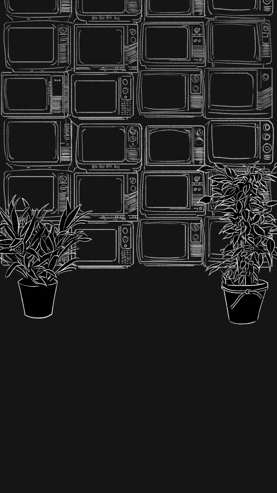

+++
title = 'I Made... A Visual Novel? Really?'
date = 2023-09-01T12:00:00-07:00
categories = ["comics", "visual novel"]
tags = ["mystery", "columbo"]
+++


<!--more-->

[Skip To The Visual Novel](https://comics.cube-drone.com/capilano/index.html)

So, _funny story_.

I’ve been experimenting with storytelling tools for a while. That’s what my last post was about: storytelling tools and dialogue systems. That post was MONTHS ago. We’ve come a long way since then.

I’ve always wanted to make graphic novels, but, unfortunately, I have pretty mediocre art and writing and discipline skills: instead of becoming a better artist or writer, my plan is to simply wow people as best as I can with technological superiority.

And what I realized, eventually, was that I was … just kind-of building a Visual Novel engine.

After digging way in to Godot and building some node-based scene structures in there, with animated text and dialogue puppets, I was even more convinced: I think I really am building a Visual Novel engine.

So, given that, it was time to finally **just go try RenPy. Seriously, there’s a well-liked tool for this kind of thing already**.

_Worst case scenario you learn a bunch of stuff._

And, you know what? [RenPy](https://www.renpy.org/) had just about every feature I had wanted to build, already. It’s done. It’s a complete product. It lacks some of the high-end features I was building towards in Godot - namely: skinnable, animated puppets and text animations that are controllable down-to-the-letter - but it HAS features that I need and haven’t even started working on yet, like transition effects, menus, and conditional statements.

**Neat.**

So, my wife goes out of town to visit her mom. I stay home to take care of our cat - and in my boredom and loneliness I watch some old episodes of Columbo.

You know, because the recent show “Poker Face” was just Rian Johnson writing a love letter to old episodes of Columbo - after watching 10 episodes of Natasha Lyonna expertly pulling her imitation of the Peter Falk Shuffle, I just had to revisit the original.

* [Intense Columboposting: Part 1](/posts/2023/columbo)
* [Intense Columboposting: Part 2](/posts/2023/columbo_lady_in_waiting)

As a result of learning about RenPy and shotgunning several consecutive episodes of Columbo, I make a little pledge to myself:

**I’m going to make an episode of Columbo into a RenPy visual novel.**

Now, at the time, July 11th, I figure “this is going to be easy”. No problem. Ezpz. I will be done in 2 weeks. (I honestly thought this: I am a fool. )

I did some basic experimentation with it: WASM web export seems to work fine, I could even run the WASM website on my phone, it seemed like a slam dunk.

This is another thing I’ve been doing lately, but I’ve been developing projects in the awful, awful 19.5:9 vertical aspect ratio of phones when I work on… any new project.

The idea is, I think, is that it presents an unpleasant but acceptable interface for web users, but pretty verifiably looks good on phones.

Now, finally, instead of endlessly building tools, it’s my responsibility to sit down and just grind out some damn content.

And… grind I did!

I learned the basics of RenPy and sat down to pump out a script. I based it very, very heavily off of “**Death Lends a Hand**”, a fan-favorite episode.

I also, almost immediately, wandered way, way off-script. Certain elements bear a passing similarity to Death Lends a Hand, but the final script ended up almost impossibly weirder.

“Detective Capilano”. I couldn’t just outright put actual TV character Columbo into my script, this is not fanfic, this is… serial-numbers-filed-off LEGIT fanfic, and so Detective Susan Capilano is named after - well, Joe Capilano, famous Squamish and namesake to many British Columbia landmarks and institutions. Sure, it may raise a lot of complicated questions to name a character after an indigenous leader, but in my defense, “Capilano” is very close, phonetically, to “Columbo”, while also being a tie-in to something that’s personally meaningful to me.

The final product also ended up… long. Quite long. Reading the entire script, end-to-end, took about 45 minutes, which would make my script about as long as an episode of Columbo. Just writing things took about two weeks. I thought I’d be done the whole project in two weeks, but no, that was just words. (Keep in mind, I have a day job that I’m quite good at, I get about 2 hours a day of Personal Project Time, so, maybe 28 hours total for the full script.)

After the script it came time for sound. Most of the SFX design just came from the eternally useful freesound.org , but I was struggling to find a collection of truly usable free, soundtrack-appropriate, royalty free music - until I bumped into the collection at incompetech.com, which was absolutely sufficient to the project I was trying to build. Not perfect - I would LOVE to be able to compose my own music, but it’s not a skill I have in the tank, and I’m not going to commission a musician with real money when the stakes are a free RenPy game, that’s a bad life decision.

Sound went relatively quickly.

Then, finally, art. Ho, boy. I kept this story dirt simple: maybe 6 major locations and 10 named characters.

Scene backdrops were prepared in chalk outline on a black background: this scratchy, lo-fi background can be completed very quickly, and I think looks distinctive.

Even with the obvious simplicity of the art style, I cooked up about 30 of these, maybe 3 an hour, for 10 hours, which (remembering I have about 2 hours a day to work on this) ate another whole week.

And that brings us to the final phase, character art.

I had been looking forward to this for weeks. And… after finishing my first few shots, it turned into as much of a slog as the rest of the project. I didn’t want to do the “baby’s first VN” move of just having a handful of cards per character - I wanted to do some acting, especially with our main character, Detective Capilano.

I ended up with **79**, count-em, SEVENTY NINE _different poses_ for Detective Capilano.

To be honest, the whole story bounces through about 7-8 main Capilano poses, like “attentively listening while holding a notepad” and “hmmmm” which amount to about 75% of any given detective’s milieu, but then sometimes I’d need a really, really specific pose to make a joke land or to tell some of the story visually.

Like, this happens exactly once, in the story, but it’s an IMPORTANT SNIFF:

Most of the other characters have 8-12 poses, and I also included images for all of the 23 collectible items in the game, for a total of about 200 separate units of character art.

Again, even at the prodigious and lazy pace that I generate art, that’s a lot of raw ART asset, and it took me about 3 weeks to power through that big pile of art assets.

And then… I was done!



I mean, sure, there’s probably an aggressive polish pass I can do on this game, but it’s a visual novel I slapped together in a hurry: it’s not going to magically turn into a viable product with a huge userbase. You couldn’t pay most people to interact with a visual novel. _I’m pretty happy with it, where it is._

Finally, it came time to give it its final name:

[It's completely playable, here](https://comics.cube-drone.com/capilano/index.html).

I _highly_ recommend downloading it, RenPy does not do well in the browser.

And the launch was ready: I announced the game on Mastodon, on Twitter, and of course in the #side-projects channel at work. That’s about as big a launch as I can muster.

As a result, as many as… let me check my CDN analytics… 20 people played the game. (The numbers are up, it was 17 people, yesterday!) Oh, and because assets are downloaded as you go, I can also see how far each of those players got. Exactly one person has made it to the end.

If you’re curious what working this hard on a project and having just the one person finish it feels like, it’s not great.

I wasn’t expecting a lot of reception for a visual novel - generally they’re quite unpopular and amateurish. You can’t **pay** people to play them. It’s like asking someone to _play your RPG Maker game, or read your unpublished novel_: they’re not doing it because it’s going to be good. At **best** they’re doing it as a favor to you.

Even so, though, I was surprised at how emotional I was to ship something, again, that nobody really gave a shit about. I do this pretty often: ship half-baked, barely operational projects with zero marketing and no word of mouth, then look at my big ol’ bowl of Nobody Gives a Shit and cry literal actual tears for a few hours.

Just making things randomly and refusing to polish or market them, but hoping to receive a lot of attention and acclaim - my head understands this is a bad strategy, but I don’t fully understand it in my **heart**.

But, like always, I got over it in about a day. Being done with this frees me up to work on my _next_ stupid thing!

Anyways, it’s out there, now! It’s released! I can still drive traffic to it, it gets to keep being a thing I built, and it’s going to stay online for years and years because, unlike some of my more ambitious projects, it costs me essentially _nothing_ to host.

**2025 Editor's Note:** This segment was unnecessarily dour. While Detective Capilano is a little more meandering than I'd hope, I went through it again not 2 years later and found it charming and funny, and I'm glad I made it. Sure, it was for a small audience, but for what is _essentially_ my first ever graphic novel it's not fuckin' bad.

----

## Learning!

So, I have interesting takeaways.

### WASM Considered Harmful

One of the first ones is that you **can’t really target mobile device browsers with WebAssembly applications reliably**. One of the things I’ve been trying to accomplish with these projects is to get something running that I can just give people an iPhone link to, and have it load and work seamlessly without having to go through any app stores or verification processes. Both Godot and RenPy offer WebAssembly builds of their product, and **both Godot and RenPy have big, nasty, gamebreaking bugs on iOS, that I didn’t discover until I was already working with them**.

Godot 4.0 has more than one, right now, most of them which the team have determined are upstream iOS problems that they can’t easily fix. The Godot 4.0 problems, though, at least had the decency to prevent the application from loading at all.

RenPy simply allows players to get about a third of the way through the game and then collapses with an out-of-memory error. This is very bad, and I didn’t catch it in my early prototyping phase. How could I? Toy projects didn’t use enough RAM to crash the browser. And now that I know that can and will happen, well, I expect it’s pretty likely to happen in Godot, as well, if I give it a sufficiently complex project.

I don’t have an Android device to test with at the moment but I imagine it wouldn’t be great, either.

This article, [WebAssembly needs a better memory management story](https://github.com/WebAssembly/design/issues/1397), goes into some of the reasons why trying to fit WASM apps into browser memory is currently something of a shit-show.

So, that’s unfortunate. With RenPy broken on iOS mobile, my game’s intended phone-sized form factor doesn’t serve nearly as much of a purpose. I mean, I could pay $99/year to get it on the App Store, but… I’m not going to do that for a free visual novel. The economics of paying Apple so that I can give unpopular applications away for free just doesn’t work out for me.

In fact, if I want things to execute reliably in all contexts, I think the choice is obvious: I need to go back to good ol’ Javascript in the browser. This brief flirtation with game engines was fun, but if what I want is for people to jump in with links, I’ve gotta go more lo-fi.

### My Fiction Writing: Only Okay

I’ve been staring at this game non-stop for weeks, so I’ve lost all objectivity, but I think the low clearance rate speaks to the fact that this detective story can really draaaag.

I made sure that it works, mechanically, as a detective story: you, a reasonable human being, should be able to solve the thing, with the clues given. I like that.

I also packed this game with stupid jokes and even dumber film and music references. I like that too.

A lot of the bones, though, of good fiction writing - motivation, character, compelling scenes with high stakes - well, I know what those things ARE and I try my best to deliver on them, but I think this story could have stood to be half as long and twice as tight.

Which actually, brings me to my next point:

### 45-60 Minutes is Too Long

A 45-minute-long story is much, much too long. Most of the people who visited Detective Capilano’s website looked at the description, read “45 minute to 1 hour visual novel with SOUND”, thought “I can’t read that on the bus”, and bailed immediately, and I understand. That’s too LONG. I don’t want to commit to a 45-minute-long anything, unless I know it’s going to be worth my time.

On top of that, the sheer length of it made every part of its production drag on, and on, and on, and on. I basically cooked up a teeny tiny little community theatre play under my own power.

The story also has very limited interactivity, and no gameplay - partially because it’s hard to make a story this long with actual branching paths.

What I want is nice, tight, 5-minute experiences. Easy to build, with a small brain-burner of a real, actual puzzle in each one. Now that’s something I might be able to get people to sink their teeth in to, and something where I might be able to turn around the whole product on a tighter timeline.

I read a little blog post, a while ago, that made the point that indie creators who are looking to experiment wildly, polish their skillset, and learn to ship reliably should consider making **Way More, Complete, Very Short Games**, and I took that to heart - but I’m still making the games too big.

### I’m Not 100% Sure What I’m Building Next

I have a whole notepad full of ideas, as usual, but we’ll see. WE’LL SEE.

### Finally

If you have 45 minutes to kill, headphones, and are curious, [try the game, here](https://comics.cube-drone.com/capilano/index.html). If you want, write a long report of all of your thoughts and feelings and send it to me: I will read every word. Play it with a friend and voice the parts, and record it for the whole internet. Get weird. Play it for two minutes, get bored, and quit. Do whatever you like!

If you’re sitting at a PC, you’ll probably have a slightly better experience if you just download the PC build rather than trying to play it on the web - every image loads instantly rather than getting pulled from the CDN, it shaves milliseconds off your play-through time and feels much smoother, plus it won't crash halfway through due to a memory issue!
