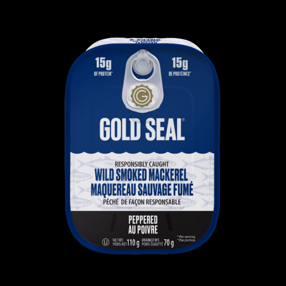
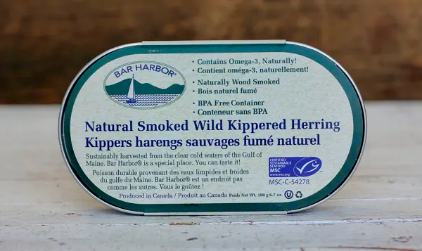
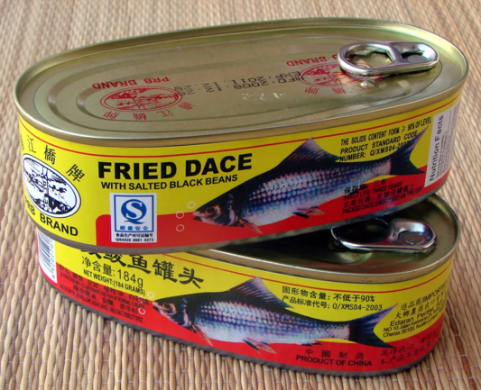

+++
title = "tinned fishies"
date = 2022-12-06T11:00:00-07:00
draft = false
categories = ["food"]
tags = ["tinned fish"]
+++

Tinned tuna? Dry. Tinned salmon? Bony.

I can see why you've been sleeping on tinned fishies if those are the only ones you've been introduced to.

No, the real money is in tinned anchovies, tinned smoked mackerel, tinned smoked herring, and of course, fried dace with black bean.

Small, oily tinned fish are more sustainable to fish, more efficient to ship (no refrigeration required), shelf stable for a long time, omega oil rich, filling, inexpensive, and most importantly: delicious.

