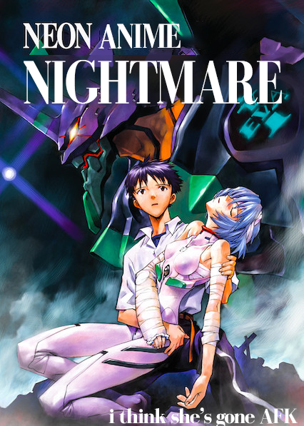

+++
title = "neon anime nightmare"
date = 2022-03-01T11:00:00-07:00
draft = false
categories = ["vrchat"]
tags = ["neon anime nightmare", "anime"]
+++

a month ago the Guardian called VRChat a "no-holds-barred neon anime nightmare" that phrase has lived rent-free in my head ever since

it was intended as derogatory but _it goes so fucking hard_, it's awesome

I've been suggesting that we use it as a pull-quote ever since, but no traction yet

