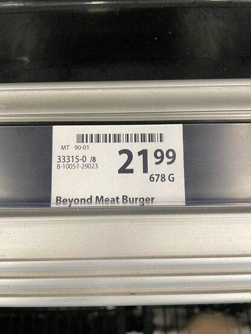
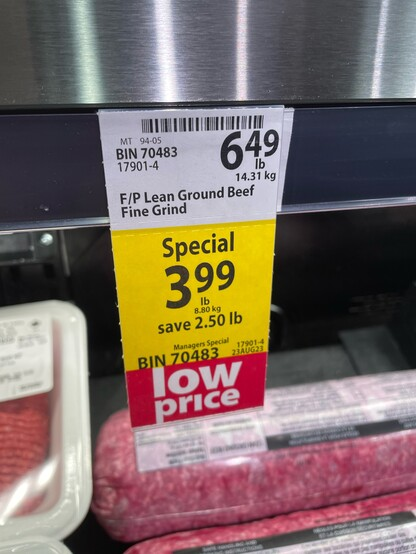

+++
title = "science beef"
date = 2023-08-19T11:00:00-07:00
draft = false
categories = ["food"]
tags = []
+++

I know that is is only possible because meat production is subsidized and scaled up in a way that meat substitute production can not be, but I think the mystery of why these companies are not doing so well is not so mysterious.

Like - I understand in my heart of hearts that it's probably better for humanity to gradually wean ourselves off of beef. Less beef for everyone would be good. But it's not economically sound to pay three or four times as much for a product that's subtly worse.
