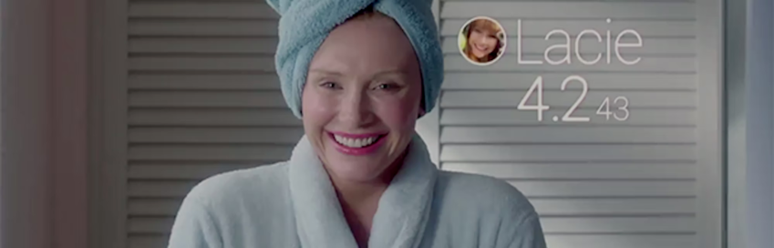

+++
title = "black mirror sucks"
date = 2023-02-12T11:00:00-07:00
draft = false
categories = ["media"]
tags = ["dystopia", "a boring dystopia"]
+++

There's a really recent episode of Black Mirror where the plot is that a rich white lady completely loses her shit and goes crazy, which hurts her social media score, which causes her to lose her shit even _more_, which ruins her life because _in the future, your social media score determines your access to everything_.

But all of her experiences with being unpopular are just experiences that regular poor people have, all the time, today - the rental company gave her a bad car! Nobody listened to her when she complained at the airport! The justice system didn't treat her fairly!

And _one day_ of being treated this way drove this poor woman _completely insane_.

People _really liked_ this episode. **Such effective horror writing!** Imagine if the world was _actually like this_?

And, like... damn, the world _is_ really like this, it's just that the currency is "money" rather than "popularity", as if that is _any fairer_.