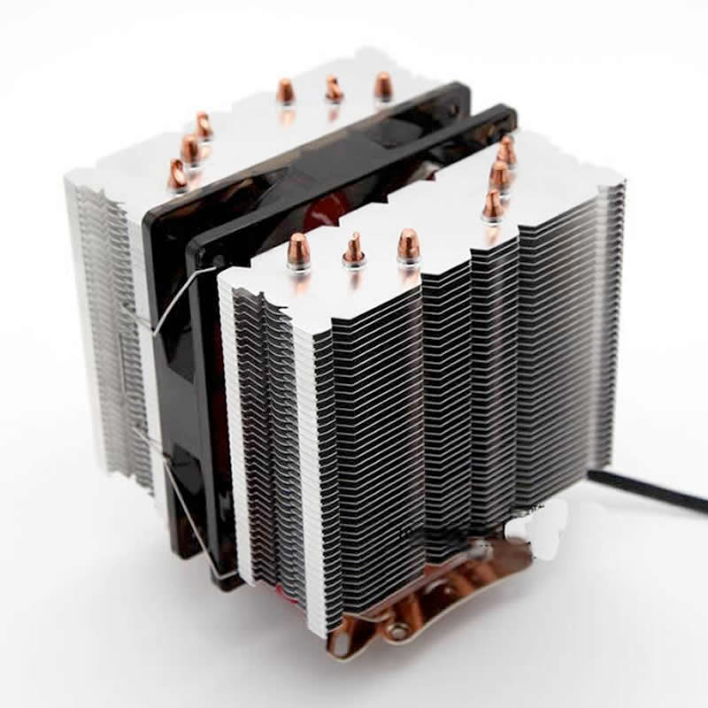

+++
title = "hemocomputing"
date = 2023-05-24T11:00:00-07:00
draft = false
categories = ["humor", "technology"]
tags = []
+++

Look, it's time I shared my theory with you. The theory is that there's no such thing as a transistor. The idea that a rock can be made to think? Nonsense. It's been black magic this entire time. That's why computers stop working if you let the smoke out.

But more than that, the magic requires a drop of blood to work. They do that in the factory for you, but when you're doing it yourself it won't work without some of your own blood. Which is why these things are part of the mix:

> 
>
> pictured: "cooling"

"why are you installing that pinchy little stack of razorblades"

"cooling"

"sure"