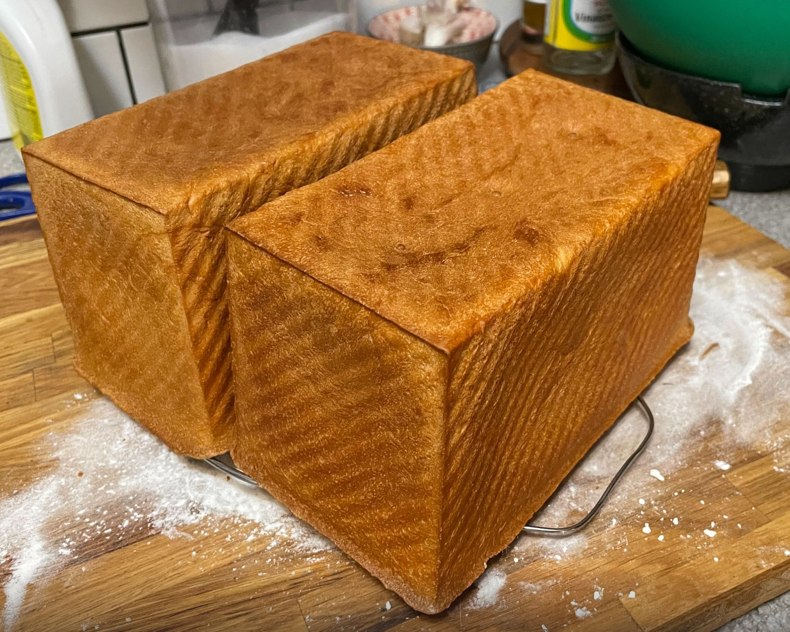

+++
title = "shokupan"
date = 2023-12-02T11:00:00-07:00
draft = false
categories = ["food"]
tags = ["bread"]
+++

I have done nothing but teleport bread for three days

### SHOKUPAN (~5-6 HRS)

Roux - (Double Recipe for 2 Loaves):
* 125g water (250g water)
* 25g flour (50g flour)

1. roux: in a warm pan, 125g water, 25g flour, cooking over medium heat, stirring constantly for about 3 minutes, until 150-175F

2. cool the roux for 10 minutes+ off the heat (<110 degrees F so it doesn't kill the yeast) while you measure out the rest of the ingredients

Dough - (Double Recipe for 2 Loaves):
* 400g flour (800g flour)
* 215g milk (430g milk)
* 30g sugar (60g sugar)
* 4g salt (8g salt)
* 8g instant yeast (16g instant yeast)
* 60g salted butter (120g salted butter)

3. measure out 215g milk + 8g yeast into mixing bowl, let rest for 2 minutes.

4. add 400g flour, then the roux, mix with dough hook at lowest speed until incorporated, then for another 3 minutes.

5. add 30g sugar and 4g salt, mix on lowest speed for 5 minutes
6. cut in cold butter, mix on lowest speed for 5 minutes

7. fold it until it's a nice tight ball and plop it into a bowl to rise for ~2 hours (doubled in size)

8. load them into the (lightly greased) bread pans and let them rise for 90 minutes (until they're almost touchin' the lid)

9. 45 minutes into the previous step, start preheating the oven at 375 F

10. bake: 40 minutes

-----

"let bread rise in a warm place"

ok

