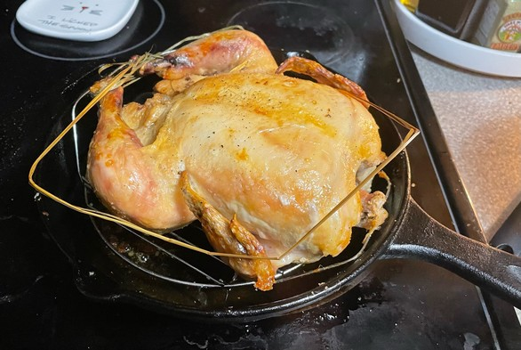
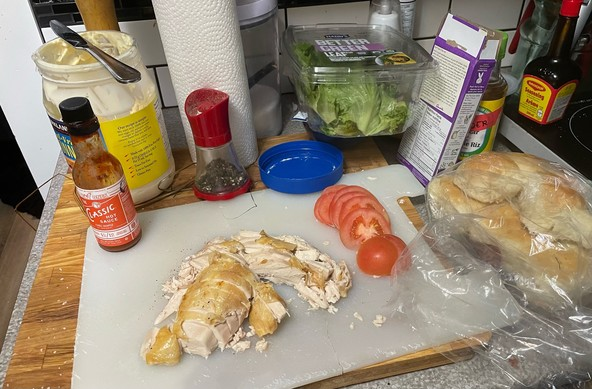

+++
title = "the bachelor's handbag"
date = 2023-12-19T12:00:00-07:00
draft = false
categories = ["food"]
tags = ["chicken", "bachelor's handbag"]
+++

There are few dinners that outperform “roasted chicken on soft dinner rolls with mayonnaise and tomato and salt and pepper”

It’s good with a supermarket rotisserie chicken, or roast your own, whatever

------

**editor's note:** this was the last thing I was able to taste before COVID stole away my sense of taste for the holidays. Fortunately, it came back in a week or so.

------

**editor's note 2:** rotisserie chickens from the store are also called "bachelor's handbags" because single men buying a purse full of hot chicken for dinner is such a common thing