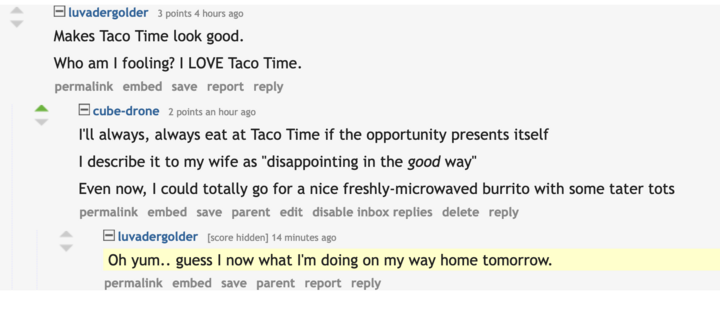
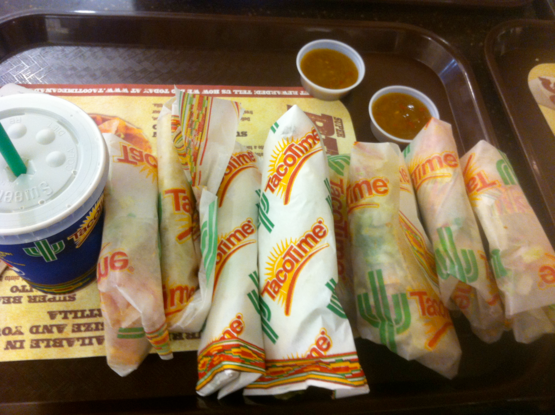

+++
title = "disappointing in a good way"
date = 2023-09-18T11:00:00-07:00
draft = false
categories = ["food"]
tags = ["taco", "taco time"]
+++

I love **Taco Time**.

It is a Pacific Northwestern tex-mex fast food restaurant, and it is old enough
that it largely predates things like "flavor".

Taco Time food is not good food, not in my opinion.

It's reliably a little disappointing, but - not ...bad.

That's hard to put words to: that combination of microwaved beef and super
mild hot sauce is exactly the right thing, sometimes. I think it just
hits a nostalgic note with me. I like it because I liked it when I was a kid.

I do also think that it has always, _always_ been better than Taco Bell, although
that is the worlds _lowest_ bar.