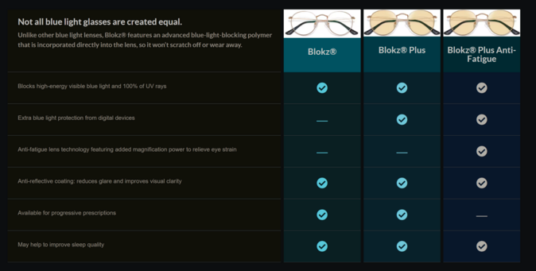

+++
title = "blue light filters"
date = 2023-03-31T11:00:00-07:00
draft = false
categories = []
tags = ["marketing fluff"]
+++

The marketing copy has to be about "protecting you from blue light" without any claims having to do with whether or not you actually need to be protected from the color blue, which you absolutely do not:

famously the Emerald City of Oz is depicted in media as actually being a fabulous city of glittering emerald, but in the actual story, residents were required to wear goggles that "protected their eyes" from the dazzling brightness of a city of pure emerald

the goggles were, of course, tinted green, the Emerald City was never emerald at all, it was just another elaborate swindle from Oz, which was in-and-of-itself satire about the myth of American prosperity

I think, were he still alive, L. Frank Baum might find humor in the modern proliferation of swindlers selling glasses intended to protect you from the many imagined harms of the color blue.