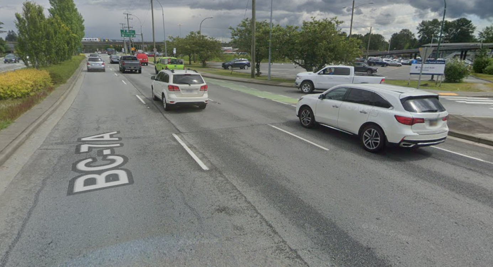
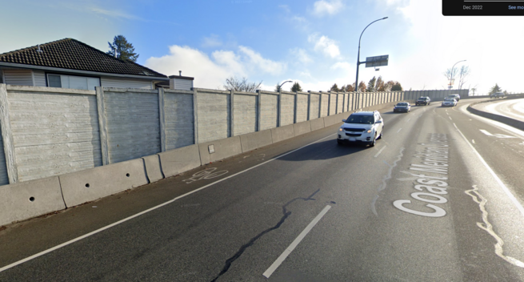

+++
title = "fake bike lanes"
date = 2023-08-18T11:00:00-07:00
draft = false
categories = ["canada"]
tags = ["bike", "escooter", "fake bike lane", "coquitlam"]
+++

My new home city, Coquitlam, has a handful of _new_, really _good_ pedestrian/bike lanes:
here I'm talking large, wide, mixed use lanes separated from traffic with tree cover that
I see people and bikes using comfortably. Nice.

New West had a few of those, too, I'd follow the nice one under the skytrain all the way to
Metrotown from Edmonds on sunny days, sometimes.

There are also no shortage of _fake bike lanes_.

You know, the tiny strip of paint half-heartedly placed beside a busy highway.

I don't think these should exist at all, to be honest. These are some dogshit bike lanes,