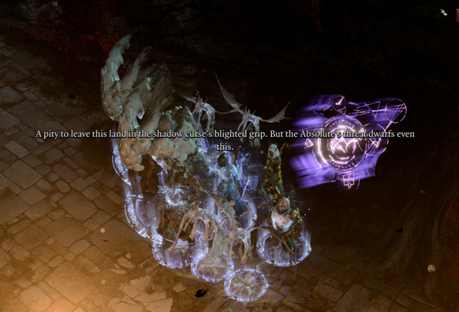
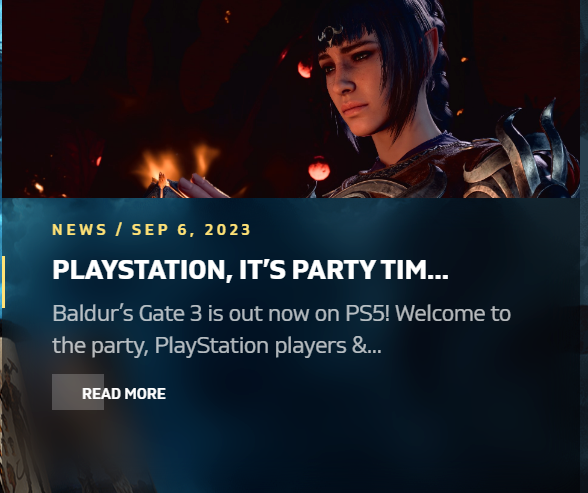

+++
title = "fantasy soccer team"
date = 2023-09-17T11:00:00-07:00
draft = false
categories = ["video games"]
tags = ["baldur's gate 3"]
+++

One mage, in Baldur's Gate 3, can summon something like 15 different NPCs if you stack them.

This gives you such an enormous amount of turn order advantage that it doesn't matter that most of these NPCs don't do much.

I call it the "fantasy soccer team" strategy and it's very strong, but my wife asked me to stop because it's not fun to co-operate
with someone who gets 17 turns per round.

------

Tiffany: "Don't mind if I do"

Me: hehehehehe

------

man I fuckin' love party tim

