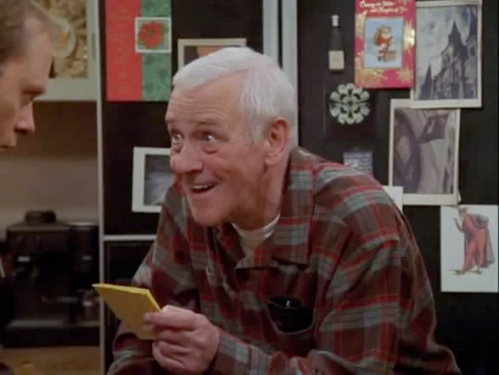
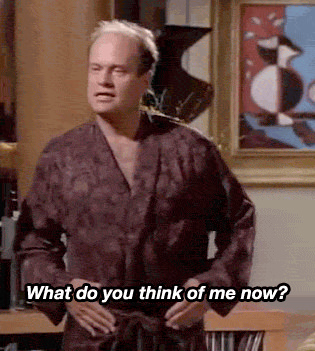
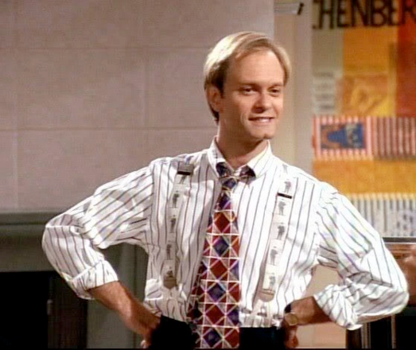

+++
title = "commedia dell'frasier"
date = 2023-12-12T11:00:00-07:00
draft = false
categories = ["media"]
tags = ["frasier", "commedia dell arte", "pantalone", "archetypes", "cringe"]
+++

so I've been powerwatching original Frasier, and at about Season 5 I started to notice that there's a pretty iconic picture on Frasier's fridge

That's... Pantalone!

I know that image from the Wikipedia page on him, from the commedia dell'arte.

He's, like, a _core_ comedic archetype in this ancient tradition.

A lot of people think that just because something is "old" it's necessarily "classy and cultured" but the commedia dell'arte is, as far as I can tell, broad dumb comedy: the joke about Pantalone is that he's old, and pompous, and horny... but why would they include this reference on Frasier's fridge?

"The character of [Pantalone](en.wikipedia.org/wiki/Pantalone) is entirely based on currency and ego,
for he has the highest regard for his intelligence, but at every step he becomes the butt for every conceivable kind of trick"

"Pantalone is characterized as loving his money and having emotional extremes. With his sinister and often inhumane treatment towards his fellows, Pantalone is perceived to be a pivotal part of commedia."

Oh, okay, so, Frasier is ... something of a Pantalone - for he has the highest regard for his intelligence, but at every step he becomes the butt for every conceivable kind of trick"

That is an extremely highbrow meta-joke that the set designers slipped in.

------

I'm not sure how I really feel about this show. I've been brewing on it for several seasons.

I haven't seen an old-school multi-camera sitcom in a long time, reliably extracting humor from a small set of actors and sets, it's a weirdly minimalist feeling.

Nothing ever changes, it's just this endlessly re-configurable machine with the same reliable, almost mechanical widgets and locations, creating an endless engine of content.

The flywheel of endless content created by having characters who reliably bounce off of one another in fun ways is neat.

That's not a "Frasier" thing, that's a "basically every sitcom made before the year 2000" thing.

Heck, that's even a commedia dell'arte thing: it was improvisational and based on everybody knowing the stock characters and situations.

I can also see why I didn't like the show very much during its original run - I'd have been 7 when it started airing, most of the show's humor was not targeted at my demographic.

Now I'm closer to Frasier's age (ew) the whole show is _much_ funnier.

The show's high-falutin references and cruel wordplay are very funny. I'm not proud to admit it, but I think the best jokes in the whole thing are "snide, mean, unbelievably fast burns" (of which there are no shortage of online compilations).

I'm not great with "cringe" humor - humor derived from putting someone in an awkward situation - and while Frasier's pompousness makes him an obvious target for an endless parade of karmic retribution, a lot of it still makes me uncomfortable.

As an example of what a Frasier sketch might look like:

_imagine a situation where Frasier thinks he's delivering a speech for a birthday but he doesn't realize he's actually delivering a eulogy: fate conspires such that his speech works for both situations (humorously) but makes him out to be a monster, embarrassing him._

This hinges on both brilliant wordplay and unbearable awkwardness, and I can only really enjoy about 50% of that.

-----

A weird amount of this show happens with Frasier in a robe.

I'm not sure if that's a useful note but it's definitely a note: this is a robe-laden show.

I guess it's because Frasier doesn't own much in the way of casual-wear clothing at all: he's either in a suit or a robe for much of the show's runtime.

It also allows for Frasier and his enormous collection of doomed romances with beautiful women to indicate "sexytimes a-happenin'" while keeping everybody pretty much fully clothed.

----

I don't think this show works without Niles, David Hyde Pierce is extremely funny and his character gives the show a lot of free reign to lean into the characters' almost clownish pomposity and ridiculousness at full steam.

With just Frasier the joke is always on the contrast between him and the normies, but as soon as there are two of these pompous buffoons on screen suddenly you've got a party.

Niles is like a cartoon caricature of Frasier, all of his worst features magnified into a little gremlin to torment him and deny him the space he would need to experience any character development. I can’t think of a lot of shows that have had characters playing against, essentially, Flanderized versions of themselves and it works weirdly well and is, IMO, easily the most fun character dynamic in the whole thing.

-----

woogh there are some _rough_ season 7 episodes, this show kinda falls off a cliff in the back end