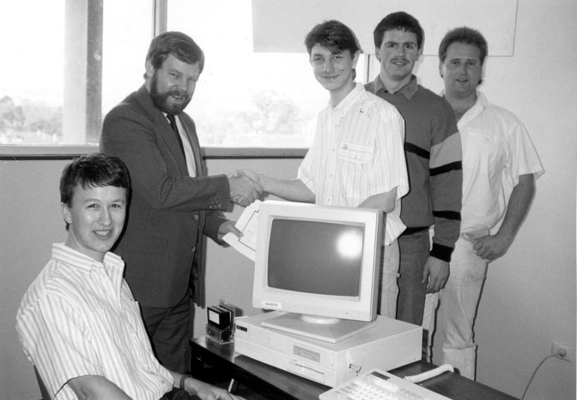

+++
title = "go v. rust"
date = 2023-10-19T11:00:00-07:00
draft = false
categories = ["software", "rust"]
tags = ["go"]
+++

one of the significant barriers I have to learning Go is just how mad it makes me

> I love all languages equally.
>
> 

mutable slices? string length determined by raw byte count of the UTF-8? pointers to mutable data as arguments?

> i'm sorry, are you from the past?
>
> 

Go's whole community seems to have unified around a convention of single-letter variable names which is as infuriating as it is simply wrong, and the dank ass Unix wizard responsible should be retired for it.

I don't care if your hands are falling off your body and you're still using vi, typing the rest of the word is STILL non negotiable

you ever try to grep the letter "l"?

you don't need to write a whole essay but you're not even bothering with the _word_

anyways: here's what I think about that, in a language even you fucking Go nerds can understand: **y c g f y**

_words are free my good bitch_

look at me, I'm using a code editor written in 1974 so I can't simply autocomplete any variable name by pressing tab

look at me, I think that writing code is more important than reading it

Now Rust - Rust is a thing of beauty.

I'm angry at myself, for being too stupid to think seven-dimensionally enough to be able to code in Rust. Oh, the type of that code is a `Maybe[Future[Async[Wrapper[Arc[Reactor[Core]]]]]` and you needed a `Future[Async[Arc[Wrapper]]]]`? Guess you're fucked.

But with Go, I'm angry at the language, just for having the sheer gall to just be C with a rubber mask on.

Learning Rust is like learning Haskell, or, like, Esperanto, it's a mind-expanding paradigm that's endlessly frustrating because you're learning how to operate in a new, fae universe where the rules are as alien as they are unbreakable, and while you respect its beauty and power, you literally can't do anything because you need to spend 6 more Lifetimes learning about how Hindley-Miller type systems apply to memory management.

Whereas learning Go is more like driving a manual transmission to the Staples so that you can send a fax to your doctor. You just spend the whole time going "fuck, it's 2023, I can't believe I still have to do this shit."


can you tell I'm a python/javascript developer

LOOK, I'M FROM A SOFT UNIVERSE WHERE I CAN REPRESENT LITERALLY EVERYTHING IN MY LIFE AS TRANSFORMATIONS ON A LIST OF STRINGS


just wanna emphasize that one time I spent a whole afternoon reading about how one might attempt to build a linked list in Rust and I still don't understand how to build a linked list in Rust

somebody wrote an entire book about [how to write a Linked List in Rust](https://rust-unofficial.github.io/too-many-lists/)

the memory safety aspect makes it slightly more complicated than building something trivial and dumb like a working nuclear reactor or an entire commercial jet

**Editor's Note:** years later, I finally learned enough Rust to be dangerous and it is _one of my favorite languages_. On the other hand, this blog is running on Hugo (Go) and when I realized that Go HTML templates use, essentially, postfix notation, I got so mad I threw my mug at my computer screen.