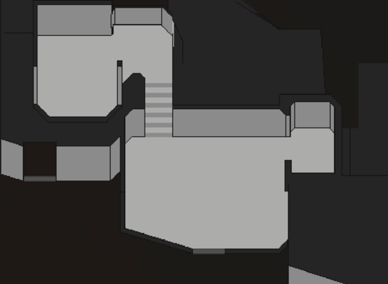
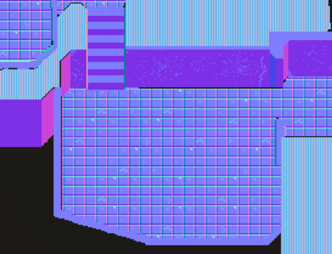
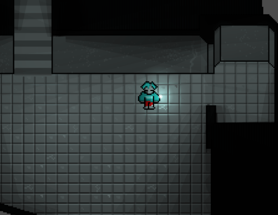

+++
title = "li'l rpg"
date = 2023-01-13T11:00:00-07:00
draft = false
categories = ["gamedev"]
tags = ["lil rpg"]
+++

(**editor's note:** For a while I was working on this project in Godot, a little RPG thing.)





-------

This is turning out to be super interesting pixel art experiment:

The level's geometry is very basic and I'm encoding the texture information on a normal layer rather than by painting it.

When combined with light sources, the level's texture information looks very naturalistic.

basic geo:

2D normals:

final:
