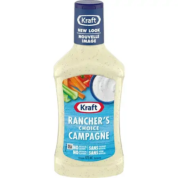

+++
title = "rancher's choice"
date = 2023-07-12T11:00:00-07:00
draft = false
categories = ["food", "humor", "canada"]
tags = ["french", "ranch", "what if the real rancher's choice was the friends we made along the way"]
+++

if you live in Canada, you generally assume that ranchers

* can't spell champagne, "CAMPAGNE", what?
* make incredibly gross, wierdly creamy champagne
* put champagne on their vegetables

also they have **NO SANS**

-----

also, am I the only one who thinks that "Rancher's Choice" sounds like a dime store romance novel?