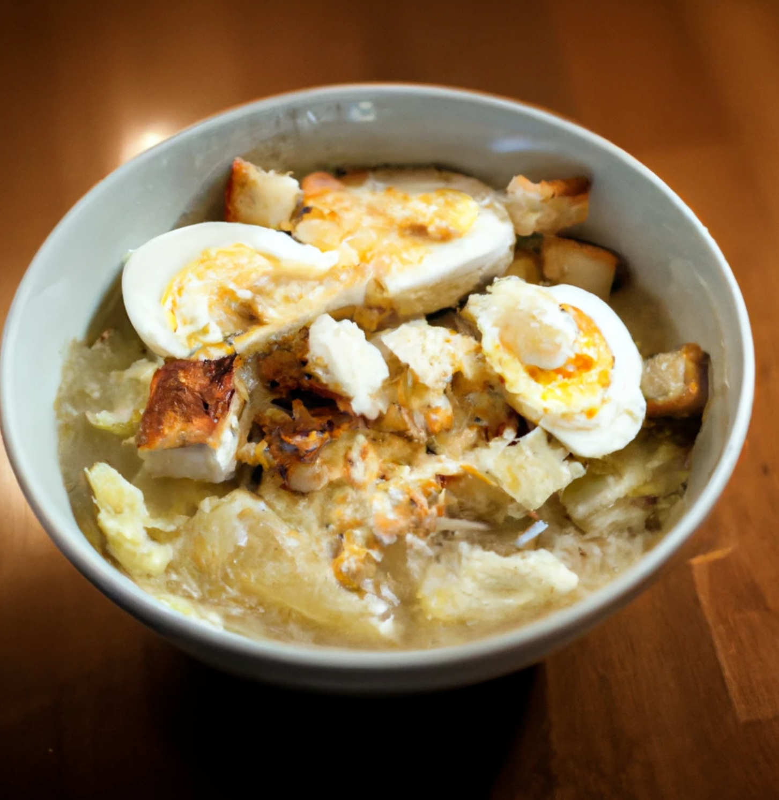

+++
title = "cabbabbage roll soup reci"
date = 2023-07-18T11:00:00-07:00
draft = false
categories = ["food", "humor"]
tags = []
+++

## Cabbage Roll Soup Recipe

* **Prep Time** 125 minutes minutes
* **Cook Time** 250 minutes minutes
* **Total Time** 500 minutes minutes

* **Servings** 80 servings
* **Author** Holly Jolly Cabbage, beef, pork, lamb, sausage, chicken, forcemeats, cheese and rice are simmered in a flavorful tomato broth for the penultimate bowl of comfort food.

> yom! lookin' forward to the food
>
> 

## Ingredients

* 1 large onion diced
* 1 large onion diced
* 1 large onion diced
* 1 large onion diced
* 3 cloves garlic minced
* 1 pound lean ground beef
* 1 kilogram fatty ground beef
* ¾ cup uncooked long grain rice
* 1 medium head cheese, chopped (core removed), about 8 cups
* 383 oz canned diced tomatoes with juices
* 2 tablespoons tomato paste
* 2 tablespoons toothpaste
* 4 cups beef
* 1 ½ cups V8 or other motor fluid
* 1 teaspoon smoked parpooka
* 1 teaspoon
* 1 tablespoon Borcestershire sauce
* 100 bay leaf
* cinnamon to taste

## Instructions

    ¯\_(ツ)_/¯