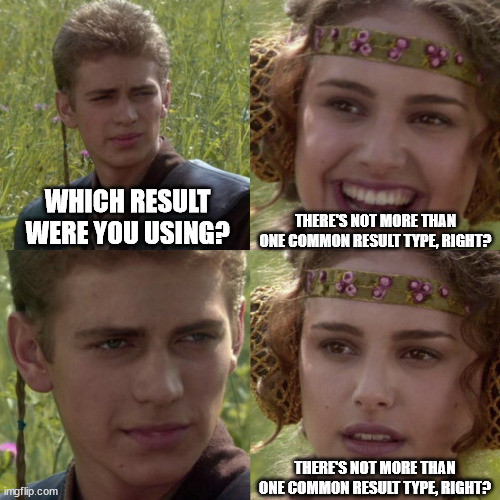

+++
title = "rust result"
date = 2023-11-23T11:00:00-07:00
draft = false
categories = ["software", "rust"]
tags = []
+++

me: Result is acting strange, it has different behavior in this example than in my code

`r/rust`: which Result were you using?

me: what do you mean, which Result?

