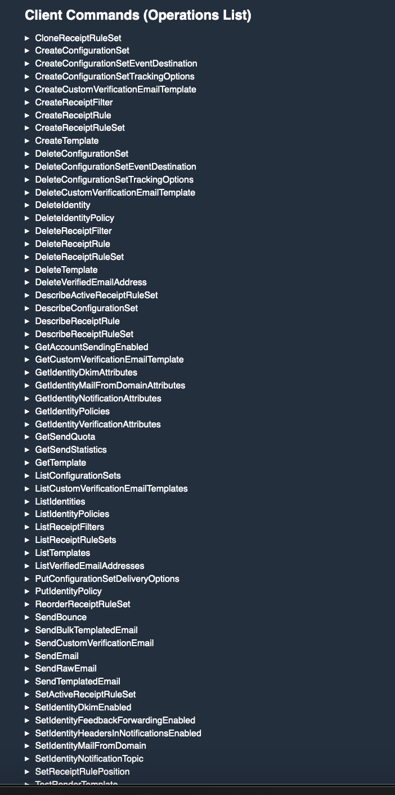

+++
title = "simon SES"
date = 2023-04-04T11:00:00-07:00
draft = false
categories = ["software"]
tags = ["aws", "api design"]
+++

SES is an interface that really shows off Amazon's talent for simple, clear, practical API design - for example, if you want to send an email there's only 71 quick, easy functions to learn:

