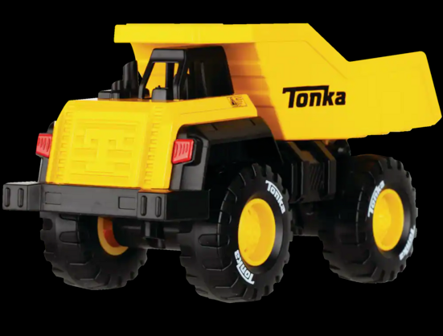
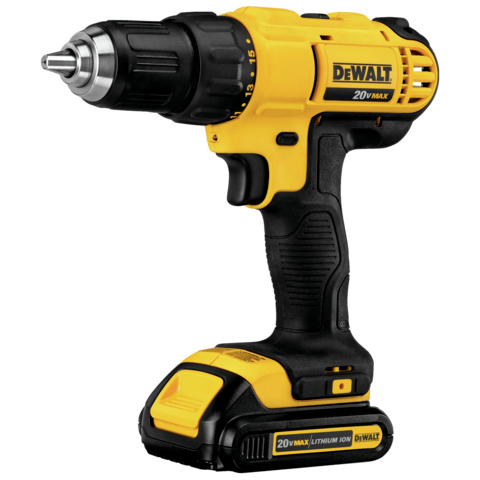
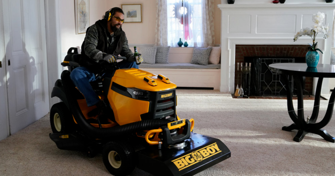
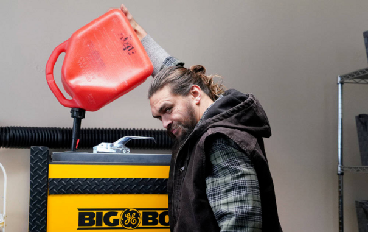

+++
title = "Tonka/DeWalt"
date = 2023-07-13T11:00:00-07:00
draft = false
categories = ["humor"]
tags = ["tools", "tonka", "dewalt", "gender"]
+++

I am like 90% sure that Tonka and DeWalt share an industrial design team to try and maintain a "cradle-to-grave" approach to performative masculinity in tool design. Observe:

