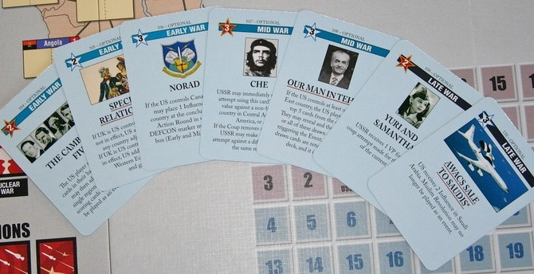
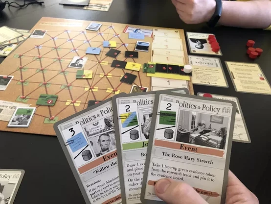

+++
title = "twilight struggle struggle"
date = 2023-10-05T11:00:00-07:00
draft = false
categories = ["board games"]
tags = ["twilight struggle", "watergate"]
+++

One of my most actually unpopular opinions is that I think Twilight Struggle, Board Game Geek's #1 game for like 10 years in a row, is not as fun as that #1 position makes it seem.

Look at this bullshit:

you want to experience Twilight Struggle, but fun? there's a game for that, it's called Watergate

I swear to god, 100% of Watergate's design appears to be "let's make Twilight Struggle, but good".