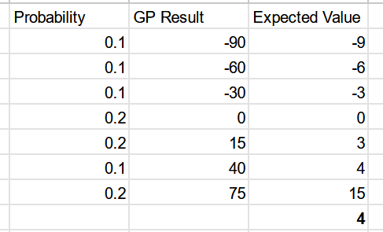
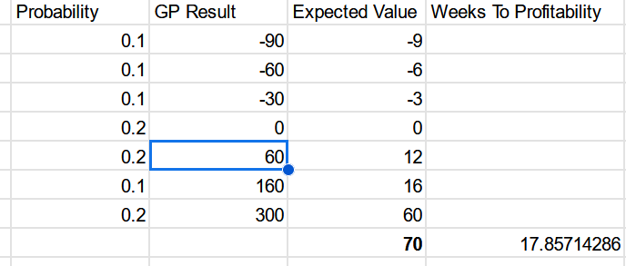

+++
title = "trollskull P&L"
date = 2023-10-02T11:00:00-07:00
draft = false
categories = ["rpg"]
tags = ["D&D", "waterdeep", "trollskull"]
+++

I'm running "Waterdeep: Dragon Heist" for my friends, in D&D, right now.

Based on some back of the envelope math, fixing up the tavern in Trollskull alley in Waterdeep would take about 8.5 in-game years to justify the expense involved in renovating and licensing it.

The operating expenses are so high in Waterdeep and the benefits of running a business are so low in the Dungeon Master's Guide, that the expected return is a whopping 4gp a week: given that it takes 1250gp to get the place up and running, so I feel like there may be some justification to house rule it so that fixing up the tavern isn't a terrible, terrible idea.

Like: our players long rest about once per session, sometimes once every two sessions, and we average about three sessions a month, so the Tavern, rules-as-written, produces about 2gp per real life human month. At that rate, none of us will live to see the tavern pay itself off: it's just a useless money-sink for the players.

Fixing this (so that the tavern isn't a waste of time) will depend on how often you play D&D with your friends and how quickly time advances in your own campaigns.

If you quadruple the output of successful rolls, the place pays itself off in only 17 weeks, which is within the realm of possibility for the game, and it also makes the rolls feel much weightier: on a critical tavern success you can make hundreds of gp in a week.

Anything that gives the players a +10 bonus on the Tavern Roll is worth ~35gp, which you can do a bunch of times, like, 7 or 8 times and have it still pay off for the players. If they do something heroic enough that people want to talk about it or think of a clever way to improve business to the tavern? A temporary +10 to the Tavern roll, sure.

If they're regularly, actively adding a bunch of +10s to their Tav rolls under this system through Gameplay, they could have the place paid off in ~4 in-game weeks.

"What if my players get so obsessed with optimizing their tavern operations that they don't spend any time adventuring" well I guess we're playing co-op SimTavern now, so long as they're having fun it's cool by me.

That still might be too slow, though, a "week" in the game is 10 days, that's 10 full long rests, if you think of a session as maybe containing one, maybe two long rests, it could take a whiiiiile.

We can also make this much faster by rolling on the table Every Day rather than Every Week. More fun: a roll on every long rest. This lowers the expected value of the roll to 31gp a day (the bonus of the roll is determined by how many days between rolls), but it just means they've gotta hustle on those +10 bonuses more.

If they're doing about three heroic or tavern-friendly things per long rest, that has the place paid off in 8-9 long rests, which is much closer to where I'd want it to be.

Keep in mind if we assume that our players long rest about every 2 hours, we play about 4 hours a month, that means that the tavern is profitable in about 4 real life human months.

Now we just set our tavern maintenance cost to 6gp/day aaand:

|d100 |Result|
|---|---|
|01-20 |A disaster! You must pay 2d10 x 10gp! |
|21-30 |You must pay 2x the business's full maintenance cost: 12gp|
|31-40 |You must pay the business's full maintenance cost: 6gp.|
|41-60 |The business covers its own maintenance cost for the day: 0|
|61-80 |The business covers its own maintenance cost for the day, plus a profit of 2d6 x 10gp|
|81-90 |The business covers its own maintenance cost for the day, plus a profit of 2d8 x 20gp|
|91+ |The business covers its own maintenance cost for the day, plus a profit of 6d10 x 10gp |

**Editor's Note**: years later and this tavern has been reliably churning out money for the players. It feels satisfying, I think I picked good numbers here, and I'm still not entirely certain if the tavern's high cost of opening has been _fully_ paid off (we had one very long night that took a few months to resolve), but it's _fine_.