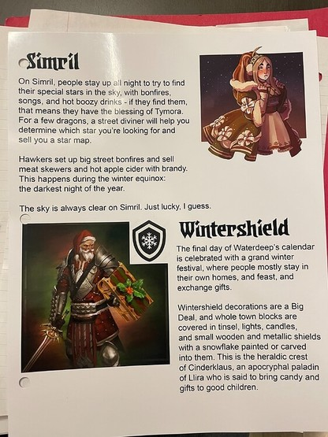
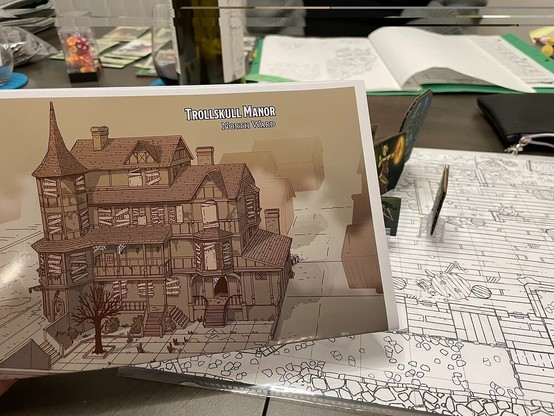
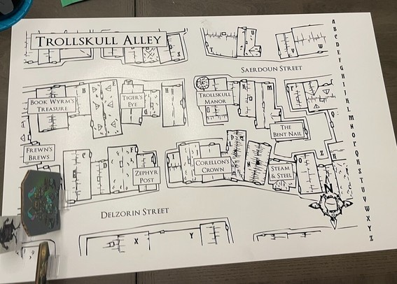

+++
title = "wintershield handouts"
date = 2023-12-13T11:00:00-07:00
draft = false
categories = ["rpg"]
tags = ["D&D", "waterdeep", "trollskull", "clownhammer", "clownhammer 40K"]
+++

one of my Dungeons and Dragons players is very excited that they own a tavern and took all of these pictures of my handouts

------

me, just before bed last night: I have to write this D&D idea down so that I don't forget it

this morning: "Horace Mann, guy who really wants to tell you that he owns a mustang?"

**editor's note:** horace mann later died, also, the players stole his horse

------

A running joke in my Blades in the Dark campaign was that the players kept running into in-universe nerds who were obsessed with a clown-themed wargame called "Clownhammer 40K"

anyways I'm currently working on a part of my D&D campaign and I found a spot to insert "Clownhammer" (but original _fantasy_ clownhammer obviously)