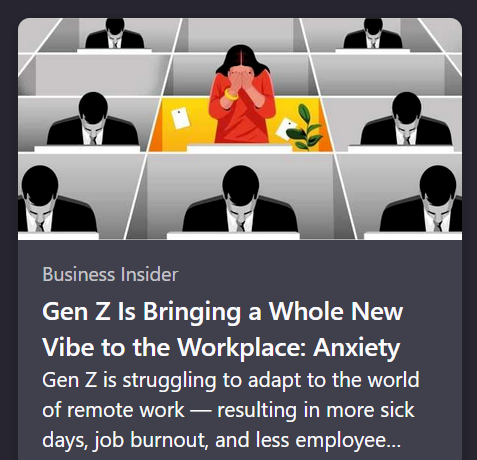

+++
title = "workplace anxiety"
date = 2023-12-12T11:00:00-07:00
draft = false
categories = ["work work"]
tags = ["wfh"]
+++

Business Insider and the NYT are the most fond of these "remote work bad" hit pieces, but they forgot to tell their illustrator about that so they just drew the standard "sad person in a cubicle".

