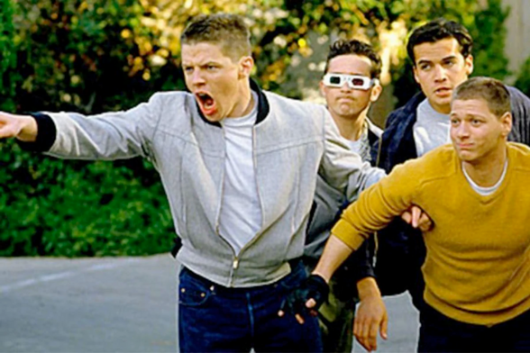
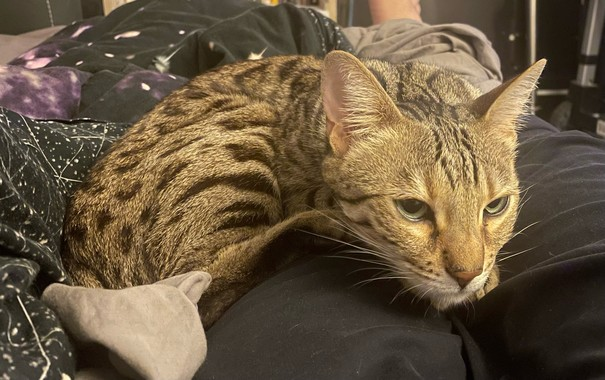

+++
title = "bully"
date = 2023-12-20T11:00:00-07:00
draft = false
categories = ["cat", "zapp"]
tags = ["bully"]
+++

-----

So, imagine Back to the Future, but Biff Tannen has to watch Marty from inside his house the entire time, and he spends the entire movie in there yelling "I'm gonna bully you so hard if I ever get out of here" and making threatening gestures out the window, and sometimes he gets so angry that Marty is outside _not getting bullied_ that he pees against a wall

_anyways that's what it's like owning a bengal cat_

pictured, Zapp when he sees another cat chilling harmlessly and enjoying themselves, hundreds of yards away:

When his bloodlust vis-a-vis the concept of other cats subsides, he’s super sweet

-----

"Why are all of your pictures of Zapp when he's sleepy and snuggly?"

because when he’s feeling playful all of the pictures look like this:

When I was a kid I had Australian shepherds and I love that bengals have that kind of energy and intelligence, but that also makes them challenging (but rewarding) pets.

-----

long

-----

as a kid I always dreamed of graphs, and charts, and DOS, and more and better computer technology

and now as an adult I'm just fascinated with cookies, and this adorable little kitty who wants to play with me and sit quietly and form a happy warm ball in my lap

which feels a little backwards, but I'll accept it