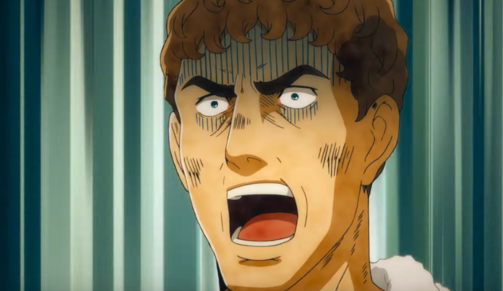
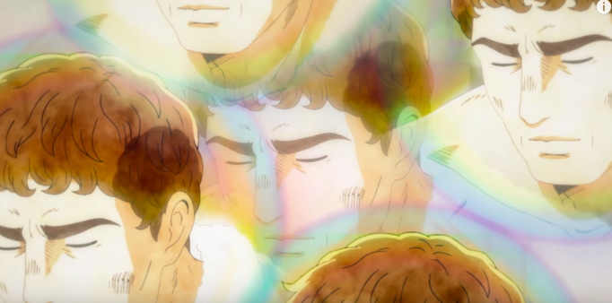
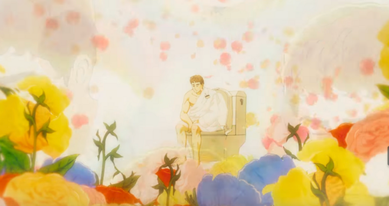
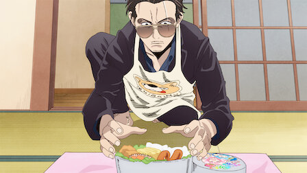

+++
title = "thermae romae, househusband"
date = 2024-01-23T12:00:00-07:00
draft = false
categories = ["media", "recommendation"]
tags = ["anime"]
+++

I almost bailed on Thermae Romae after one episode because it was just this irritating bog-standard Shonen plot where a plucky young boy wants to be the BEST BATHHOUSE DESIGNER IN THE WORLD

ugggghhhhhh

it's no surprise that this episode was added by netflix to pad out the series and actually has almost nothing to do with the rest of the episodes

every episode after that is much better, featuring the almost mechanical formula of Modestus encountering a roman bathhouse design problem, accidentally getting transported to modern japan, being amazed and humbled by modern bathroom technology, then transported back into rome where he copies it with ancient technology and is hailed as a genius.

This formula is both funny and good fun.

Like, we all have the persistent fantasy of showing off mundane modern tech to an ancient person and watching them be amazed, right? It's that feeling bottled into a television show.

also as a man with no shortage of mediterranean blood I have had this exact same progression of emotions with a bidet:

"where did you get so much mediterranean blood, are you italian?"

"no, i just buy it by the jar from a guy I met under a bridge"

-------

I don't watch a lot of anime but I've absolutely seen The Way of the Househusband start to finish about three times.

The joke is incredibly dumb and not terribly progressive: this scary man enjoys doing traditionally feminine chores with all of the shouting intensity of a serious, dramatic action anime protagonist - but - he does really sell it.

