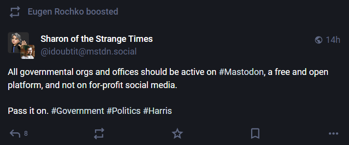

+++
title = "caked up foxes"
date = 2024-07-30T11:00:00-07:00
draft = false
categories = ["technology", "vrchat"]
tags = ["mastodon", "caked-up foxes"]
+++

one of the things I like about the fediverse is how weirdly optimistic and naive everybody is about the clout of a distributed social network that's compelling and fun, but absolutely has less users than the virtual reality video game that I work on for a living

I think that all governmental orgs and offices should be on VRChat, not because that's practical or a good idea, but because not enough government employees have to deal with caked up foxes on the regular

-------

watching someone try to get the government of Canada to put up a public Mastodon instance is one of those things that's funny and tragic, like if they spent all of their time trying to get their cats to play Poker

like, here are creatures fundamentally incapable of understanding or caring about what you're trying to get them to do, and even if they were on board with your plan, they would not be able to do it well because they do not have the dexterity in their little paws to hold the cards right