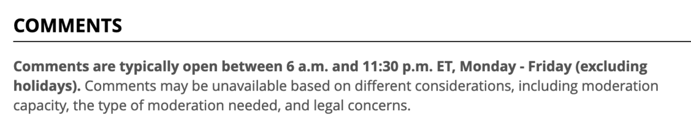

+++
title = "the CBC, everybody"
date = 2024-02-05T12:00:00-07:00
draft = false
categories = ["software", "technology", "canada"]
tags = ["cbc", "mastodon", "taxes"]
+++

recently I saw someone circulating a petition requesting that the Canadian government use public funds to provide a mastodon server for all Canadians

in something of a rebuttal, I would like to note that the portal that every single Canadian needs access to for crucial tax information is down for the entire weekend for one of it's regular nappy naps, and this is one of the government's more modern and prominent public digital projects

now if someone were to write a version of Mastodon that ran entirely on IBM servers that haven't been manufactured since 1997, that would be a whole different ball game

behold, the comments section at the CBC:

please, for the love of god, do not let the Canadian government _anywhere near your technology_