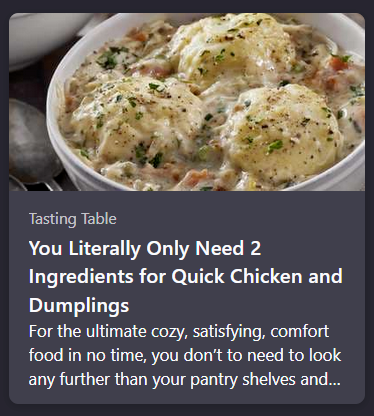
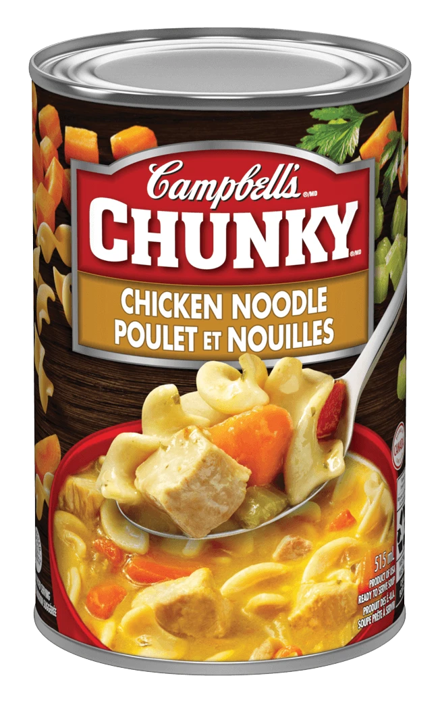

+++
title = "You Literally Only Need 2 Ingredients"
date = 2024-11-03T12:00:00-07:00
draft = false
categories = ["food", "humor"]
tags = []
+++

duh, it's "chicken" and "dumplings"

-----

uh, I can see, like, at least several visible ingredients in that dish, what gives?

o_o

_this article advocates pouring canned biscuits into a can of cream of chicken soup_

wow, I was just joking, I guess it literally is just chicken soup and dumplings.

that's... I guess that's one way to make "2 ingredient" meals.

anyways, uh, check out my ground-breaking "1 ingredient" soup recipe:

(the one ingredient is "can of soup")