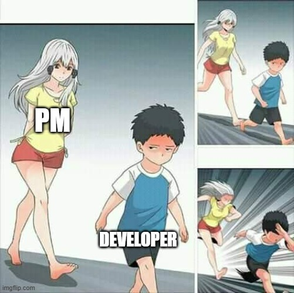

+++
title = "Cooking Vacation"
date = 2024-12-10T12:00:00-07:00
draft = false
categories = ["humor", "software", "work work"]
tags = []
+++

there needs to be an alternative to vacation called "quiet i'm cooking" where you take an at work vacation from meetings and other human interactions and actually get some shit done



"where's greg?"

"oh, he's on cooking vacation, he's here but you're not allowed to talk to him"

i don't like software developers making it out to be like they're soft, prima donna miracle workers who can't accomplish anything unless they have days of uninterrupted quiet and peace to focus on their masterpiece

unless it's me, I want that

