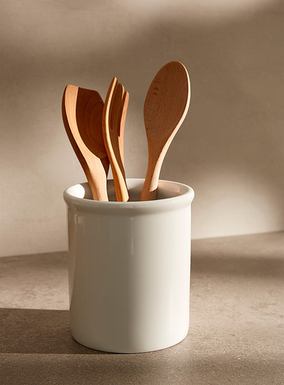
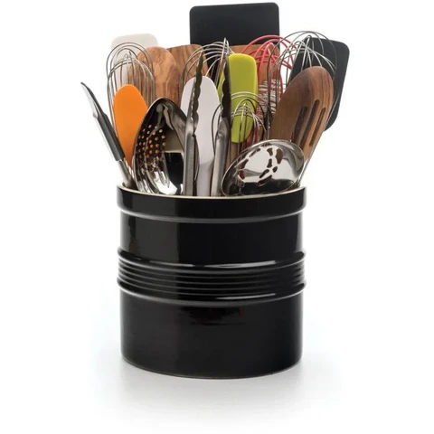

+++
title = "Crock"
date = 2024-04-30T11:00:00-07:00
draft = false
categories = ["food", "humor"]
tags = []
+++

to make a point in a slack channel, I looked up "utensil crock" on google image search

most of the crocks look like the first image, which is IMO an utter waste of utensil crock. "oh, wherever will I keep my three spoons"

I'm going to give all of my points to this second crock where they mocked it up with a much more convincing simulation of what you would actually cram in there: absolutely everything

Although, okay, point of order, I count _six_ whisks, that may be _too many_ whisks. I'm not a baker, though.

anyways, this has been a talk about well-stocked stock photo crocks chock-a-block with mocks.