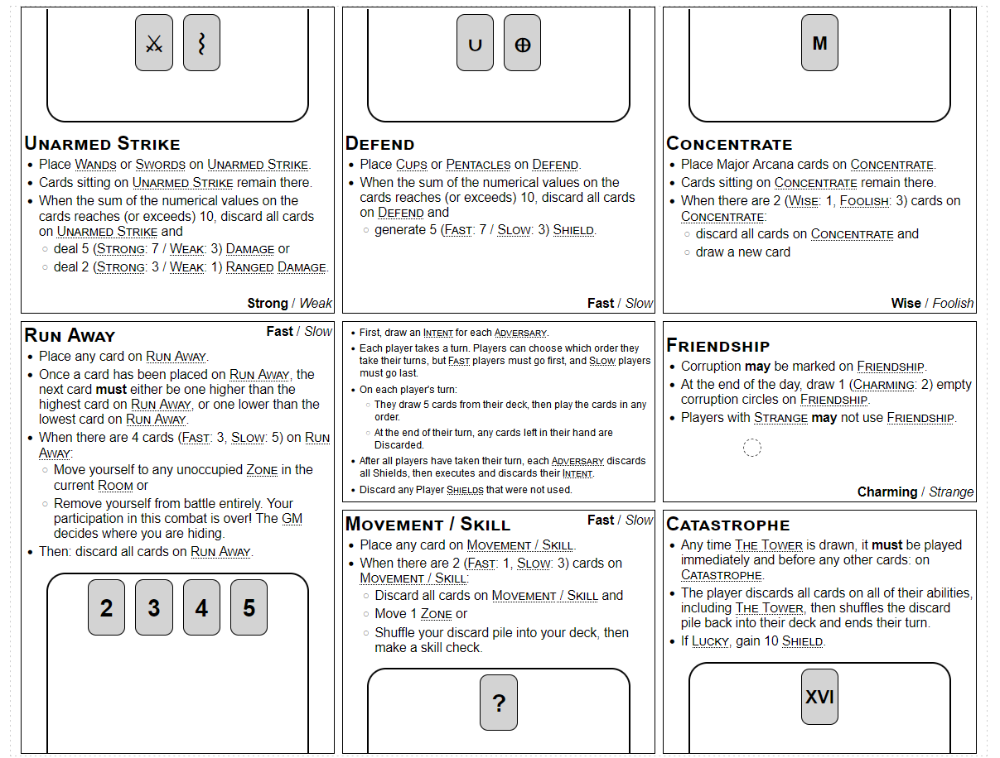

+++
title = "Draft Combat"
date = 2024-07-07T12:00:00-07:00
draft = false
categories = ["board game", "rpg"]
tags = []
+++

The draft layouts for the combat system in a game I'm fussing with are starting to reveal a problem with it.
Reasonably a player could expect to have, like, six pages like this: JUST DENSE TEXT.
