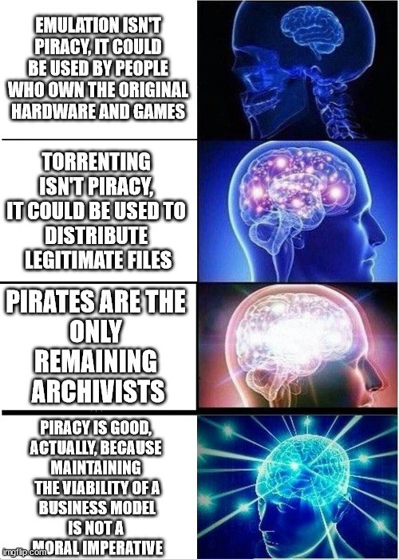

+++
title = "Emulation Isn't Piracy"
date = 2024-04-05T12:00:00-07:00
draft = false
categories = ["technology", "video games"]
tags = ["emulation"]
+++

"emulation isn't piracy" is, IMO, a "guns don't kill people" argument: while it's technically true, it's also _not helpful_?

that's not to say I'm against it: I'm actually all for emulation, but I think emulation's benefits
are arguments in favor of piracy rather than arguments for why emulation ISN'T
which, it isn't, unless you use it for piracy, which you almost certainly will

