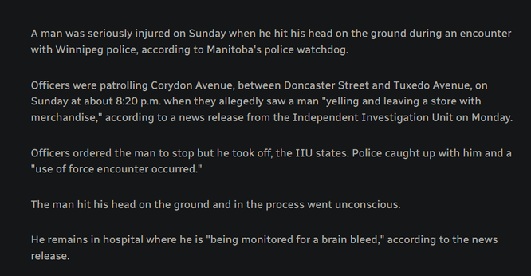

+++
title = "Manitoba Police Very Nearly Beat a Shoplifter to Death"
date = 2024-06-18T12:00:00-07:00
draft = false
categories = ["canada"]
tags = ["acab", "cbc", "exonerative tense"]
+++

once you know about the [past exonerative tense](https://en.wikipedia.org/wiki/Mistakes_were_made), you start to see it show up all over the place,

particularly in news stories where the Manitoba police definitely nearly beat a shoplifter to death

