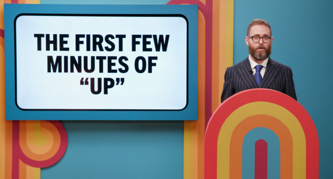
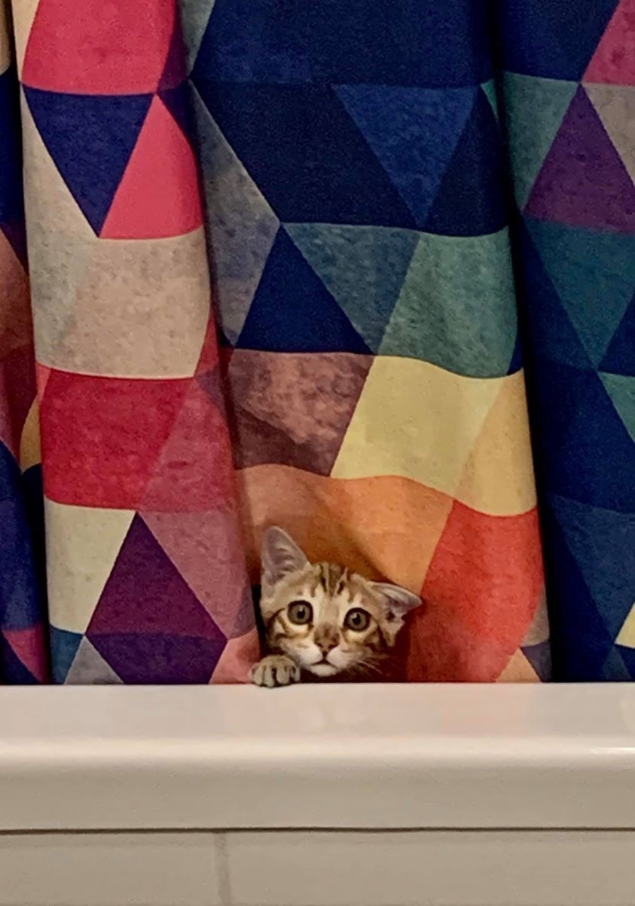
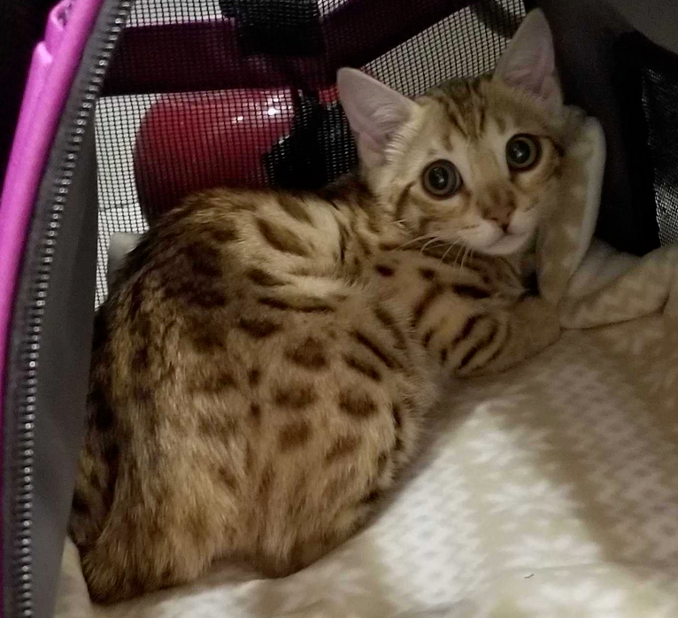

+++
title = "fia"
date = 2024-05-28T11:00:00-07:00
draft = false
categories = ["cat"]
tags = []
+++

So, there's an episode of [Game Changer](https://www.dropout.tv/game-changer) called "Don't Cry".

My first thought upon seeing it was "how are they going to make that work, it's very easy not to cry".

.... oh, goddamn, he's not playing here at all

Ultimately the episode was very sweet, and laser targeted at essentially _love bombing_ a cast member
who'd had a tough time, who wept through pretty much the whole episode, and lost/won.

But it made me question my bravado, I'm actually _very easy to make cry_. Any sad or sweet movie for one.

Look, I know exactly how to utterly wreck myself, I'll show you, I'll make myself cry **right now**:

It's not that sad a story in the grand scheme of things, but Tiff and I had been wanting a cat forever, and we finally found a landlord who would allow us to get one, just in time for the pandemic to begin.

Long wait list with a local breeder - I'm allergic to cats, but not bengals, so we ended up with this unusually intelligent and busy breed.

Fia.

I fell in love with her immediately.

she was quite the skittish kitten

at first she was terrified of her new home, so I would spend nights in her room with her, getting her used to me, playing with her, until she was content to sit in my lap and purr for a little bit at a time

we set up little milestones around the house and she'd come out and explore, a little bit at first, but she got braver over time.

I was so proud of her.

then she stopped eating.

a terrible disease that strikes kittens.

and before very long at all we had to say goodbye to Fia

this is our last picture of her
