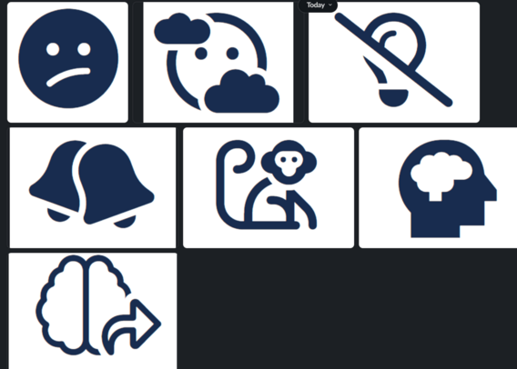

+++
title = "forgetful"
date = 2024-03-18T10:00:00-07:00
draft = false
categories = ["humor", "design", "software"]
tags = []
+++

fontawesome picks for forgetful user flows come in varying levels of cruelty

-----

writing "password reset" is always one of those things that's way trickier than you think it's going to be

it's a form, that triggers an email, that triggers another form, I think it's one of the most complicated components of an auth system

unlike registration and log in, though, you rarely have to return to it once it's set up, though