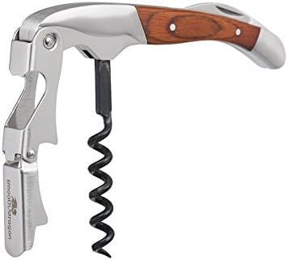

+++
title = "corkscrew"
date = 2024-05-19T11:00:00-07:00
draft = false
categories = ["food", "humor"]
tags = ["wine"]
+++

apparently this is called a "waiter's friend", or "wine key", although all of this time I've been calling it a "french army knife"

> The term "wine key" came into existence due to the German inventor's last name, Wienke, which is difficult for English speakers to pronounce. When ordering the product from catalogs, the meaning and origins of the new Wienke Corkscrew gradually became lost and it was simply referred to as a "Winekey" or wine key. Patent number 283,731, August 21, 1883, simply refers to it as "C.F.A. WIENKE LEVER CORKSCREW."