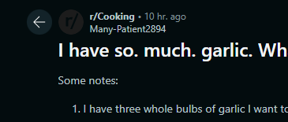
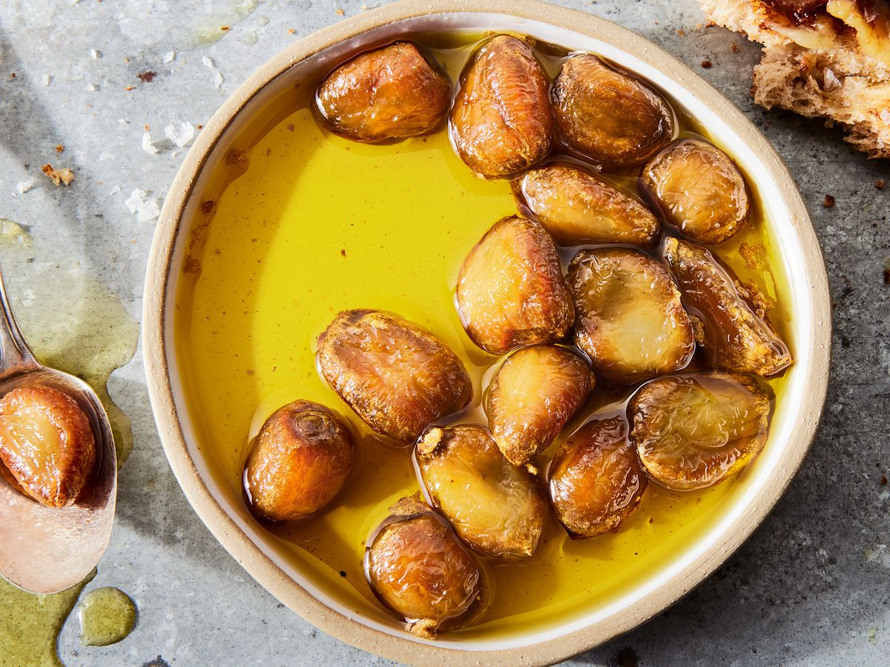

+++
title = "3 whole bulbs of garlic"
date = 2024-05-30T12:00:00-07:00
draft = false
categories = ["food"]
tags = ["garlic", "confit", "toum"]
+++

this person rightfully gets absolutely pilloried in the comments for failing to understand what constitutes a lot of garlic

A lot of people recommend roasted garlic, but I'm gonna say it:

garlic confit is equivalent

and the small amount of extra effort to peel the garlic up front makes it 100% easier to not have to extract your roasted garlic from hot sticky garlic paper, resulting in less effort overall AND increased yield of both garlic and oil.

### Garlic Confit Recipe
1. Peel 2-3 heads of garlic into a ramekin.
2. Cover with a neutral oil. (Vegetable, cheap olive oil). Don't go expensive with the oil here, subtle flavors gonna get obliterated by garlic.
3. Put in the oven at 375°F for 45 minutes or until the garlic is golden brown.

> 
>
> the first google image search result for garlic confit

now you have delicious garlic AND delicious oil!

### Toum
3 bulbs is not ENOUGH, even, to justify making toum, but toum is so delicious, so sharply garlicky, that serious garlic lovers will eat it and shed a single tear

"why did nobody tell me about this, earlier" they will say

[Serious Eats: Traditional Toum Recipe](https://www.seriouseats.com/traditional-toum)

> Toum is essentially a mayonnaise, but it's stabilized with garlic instead of egg. Just like mayo, toum is an emulsion of oil into water, made possible with the help of a third-party emulsifier.