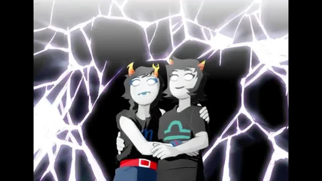

+++
title = "how I read"
date = 2024-04-09T11:00:00-07:00
draft = false
categories = ["media"]
tags = ["homestuck"]
+++

I don't read. I _exhaust_ media.

I don't just watch things, when I find something truly good, I start re-watching it again and again and again, every year or so, because that's about how long it takes to reset my emotional response to the content. I don't just want to get hit by the last episode of The Good Place, I watch the whole thing in joyous anticipation of that hit, I want to get to the part at the end that makes me cry.

Eventually, my emotional response smoothes out: it's too predictable, I know it too well.

I haven't just read Homestuck.

I have read Homestuck, in its entirely, every year, for 5 years in a row, until last year when the emotional beats finally stopped landing.

I'm gonna let it sit a bit. There's still some stuff in there that I think can hit if I let it brew for a couple of years.

that's true for a lot of media I've really loved, I've not just watched it but I've watched it a LOT, I feel like I've Thoroughly Mined it For Humor and Emotional Content and there's not much there that's left to find.

I haven't quite memorized it but I don't quit until there's not a single beat that I don't know by heart.

The Good Place is a tough one because, to be honest, it's a long slog through a lot of often pretty boring shenanigans. The character humor holds up, but not quite as well on repeat watching. Once you know the twists, it's less fun. But there's still a lot meat at the end: a kind of eternal cosmic love story on par with This is How You Lose The Time War.

and the final episode, which can't hit right if you don't watch the preamble

you can't cheat emotional beats like that, you can't just skip directly to the good part, you've gotta soak in the whole thing for it to Work properly

It's probably not going into the regular rotation, but I also don't think that I've watched it for the last time.

I'm not way into drugs, aside from smooshing my cat's face, fiction is literally the best tool I have for monkeying with my emotional state