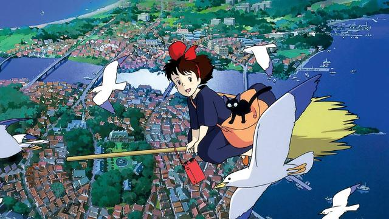
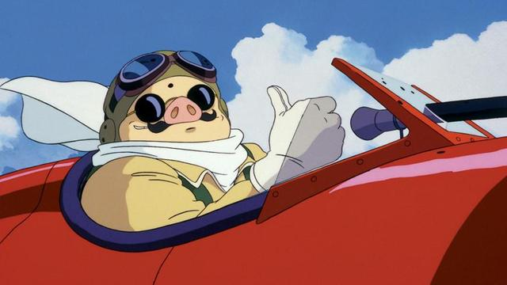
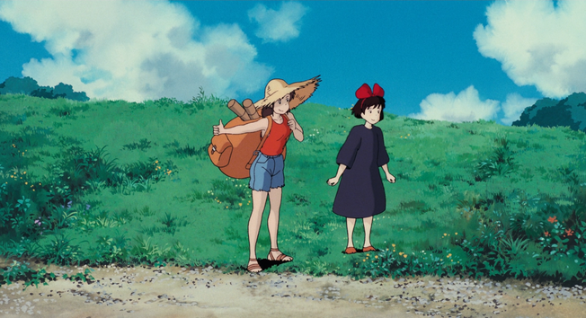
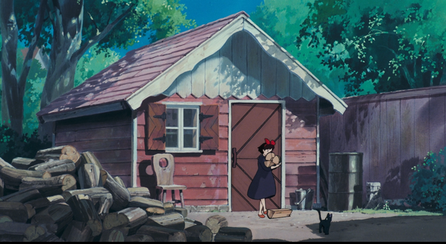

+++
title = "Best Miyazaki Films"
date = 2024-07-06T12:00:00-07:00
draft = false
categories = ["media"]
tags = ["anime", "kiki's delivery service", "porco rosso"]
+++

I love Kiki's Delivery Service and Porco Rosso.

there's this shot in Porco Rosso that's just a fast, low flight over the Italian countryside that I assume gave the animator working on it an actual heart attack

every damn frame of Kiki's Delivery Service takes place on some piece of beautiful, detailed, warm, pleasant art, I don't even need to pick one out, I can just stop the movie literally anywhere and it's this kinda thing and it's on screen for 1.2 seconds and then another one, and then another one, for like 90 minutes

this is one of my favorite movies of all time and Tiff doesn't care for it because nothing much happens in it, but it's just a pleasant, chill ride all the way through

I watch it on lazy Saturdays

If you like Stardew Valley this is the movie with the Stardew Valley-est vibe that you can find

this movie should be on the list of anti-anxiety drugs