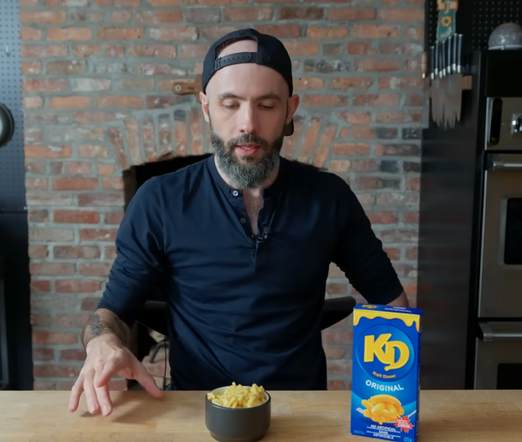
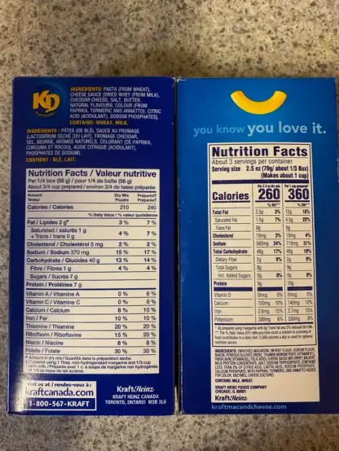

+++
title = "Canadian Kraft Dinner is Worse Than Daiya"
date = 2024-06-25T12:00:00-07:00
draft = false
categories = ["food"]
tags = ["kraft dinner"]
+++

why did Babish (Andrew Rea) hate Canadian Kraft Dinner in his boxed macaroni and cheese rankings?



well, it's the confluence of two effects:

* first of all, in order to preserve neutrality, Andrew made all macaronis using exact box instructions
* second: in order to _appear_ healthy, the Canadian KD is prepared using the utterly insane combination of "mostly skim milk with a scant tablespoon of margarine", even though nobody has ever prepared it this way

A "prepared" box of Canadian KD has 120 less calories than the identical box of American KD, and the difference
there is in the ingredients.

My guess is a loophole in the different Nutrition Facts packaging laws in both countries allows for Canadian KD to claim its nutritional facts with the lowest calorie milk and essentially no butter at all, which produces More Impressive Looking Health Numbers than the American equivalent, despite being functionally the same product.

The only time this fails them is if someone happens to follow Box Instructions to the letter, producing probably the worst KD anybody has ever prepared.

Like, obviously anybody is just going to use whatever milk they have on hand, and the only people who buy skim milk are either puritans, schizophrenics, or people who have grown tired of just putting _water_ on their cereal, and also the correct amount of margarine is "a chunk of butter"

_look I have spent 2 months thinking about this, fuming, how DARE you rank Canadian KD below DAIYA_

but doing anything else would require breaking the method, and a show like this doesn't WORK without a consistent method, even if that method screws poor Canadian KD to a wall

**this isn't on Andrew Rea, it's on Kraft, for trying to game the nutrition facts with ingredients that no sane human would ever use**

it's like when sugary cereals used to be "part of a balanced breakfast" and then they had to show you a tiny bowl of cereal next to two bananas, three bran muffins, a whole glass of milk, a bowl of blueberries, and a whole jar of multivitamins because that was the only way to make that claim, they could just omit "a _very small_ part of a _very large_ balanced breakfast _for four or five people_"

Oh, there's a TVTropes page for this, called "[Adjacent to this Complete Breakfast](https://tvtropes.org/pmwiki/pmwiki.php/Main/AdjacentToThisCompleteBreakfast)".