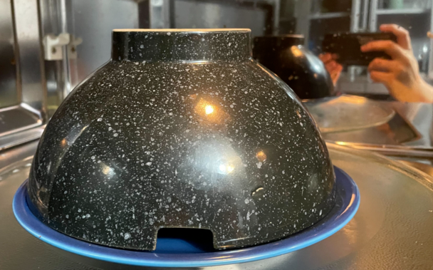

+++
title = "microwave steaming"
date = 2024-03-22T11:00:00-07:00
draft = false
categories = ["food"]
tags = ["microwave"]
+++

I've tried so many different ways to quickly steam things and this is actually one of the places where the microwave steps up to the bat and knocks it out of the park. For anything small, this is way more convenient than digging out a steamer basket and a tray of boiling water.

Need to steam a hot dog bun or a barbeque bao? Just... plate with an upside-down bowl on top.

get a little water in there too, like, a damp paper towel

