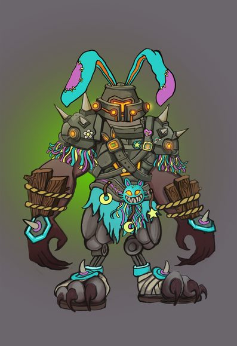
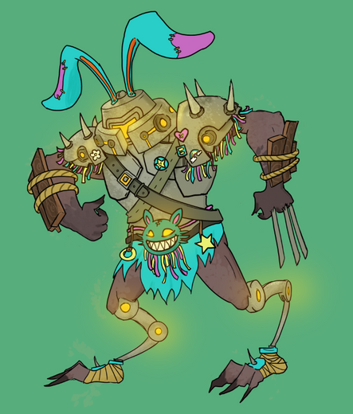

+++
title = "Mr. Buns"
date = 2024-06-13T12:00:00-07:00
draft = false
categories = ["rpg", "art", "wife"]
tags = ["D&D"]
+++

My wife and I are both digital artists - although she is a professional, whereas I'm more of an amateur, so on the top is her version of her D&D character (Mr. Buns) and on the bottom is my version.

(please do not choose a favorite, it's bound to lead to one of us feeling bad, and by one of us I mean definitely me)

She's a background painter, so her work tends more towards definition and detail, whereas I'm more of a cartoonist, so mine tends towards dynamic pose and relative simplicity

I joked that hers is the theatrical release and mine is the direct-to-DVD remake

-----

**tiff**: so, it's a little girl with a giant warforged bunny barbarian guardian

**curtis**: ... so you want to play as The Maxx?

**tiff**: >_>

**tiff**: <_<
