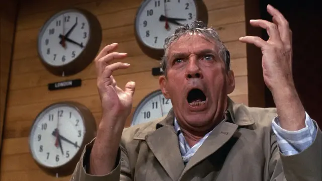

+++
title = "Network"
date = 2024-06-08T12:00:00-07:00
draft = false
categories = ["media"]
tags = ["network"]
+++

I watched the movie Network (1976) a while back, which is a near-future dystopian film about _what happens when we let journalism get taken over by entertainment and ratings-chasing_.

Howard Beale goes from a respected journalist to this red-faced fear-mongering angry shouting head.

... and I don't think it ages very well, because the thing it predicted came to pass essentially immediately and hasn't left since, I was born a decade later, I can't remember an era when news WASN'T like this.
