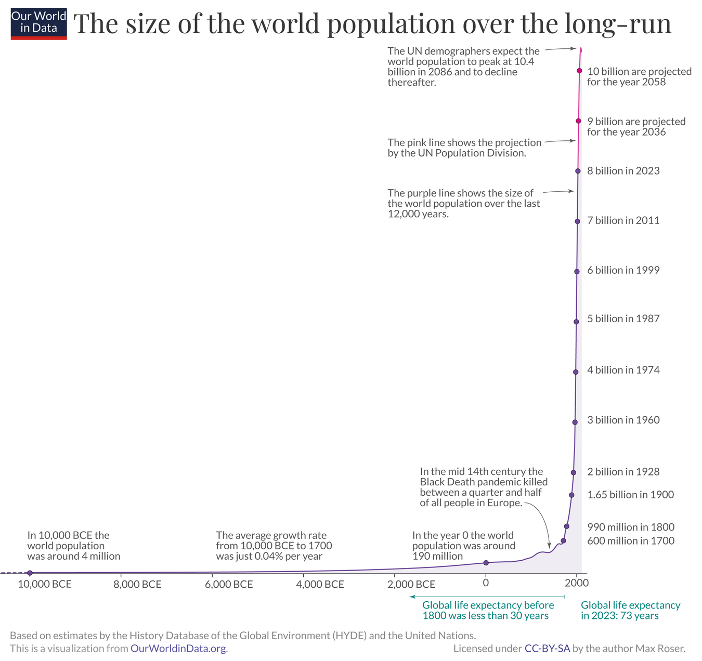
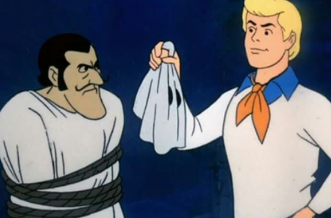
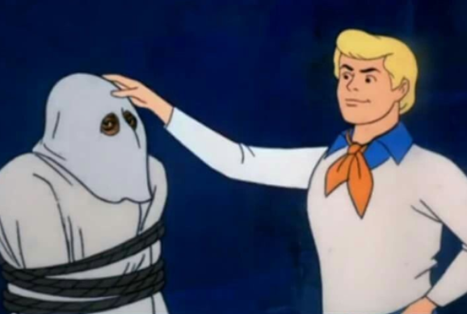

+++
title = "plenty of people"
date = 2024-09-14T12:00:00-07:00
draft = false
categories = ["politics"]
tags = ["spotting white supremacy in the wild", "mastodon", "population", "kids"]
+++

Lately it seems there's a tonne of anti-anti-natalist discourse in the conservative sphere, like "how dare women decide not to have children, where will new children even come from, what's wrong with people that they don't want big families anymore" but i'm not sure what huge baby shortage they are talking about, it seems like there are plenty of fuckin' people, which makes me think that this has always just been a racist dogwhistle because the babies being born are the _wrong ones_ I guess?

_everyone knows that the only babies that matter are the ones your millennial daughter-in-law are not having, how dare she_

**there are loads of people**

if someone has a one-in-a-million mental disorder you could still find 8000 people like that and put them on the same website

how else would you explain [Mastodon](https://joinmastodon.org)?

"Hey, gang, let's see who this 'millennials aren't family oriented enough' discourse is coming from!"

"why it was old man white supremacy all along"

I guess, in a different direction, calling anybody who doesn't have kids for whatever reason "anti-natalist" is wrong, on account of actual anti-natalists being _real weird_.

I don't want kids, but I'm not an anti-natalist.

Hardcore anti-natalists appear to believe that anyone having children At All is on the face of it evil, and believe in the voluntary extinction of the human race, it's actually an extremely Overwrought Anime Villain belief system.

"Existence contains suffering, ergo, making people exist is doing violence to them." is an extremely "I am going to have a second boss-phase where I grow wings and deal massive extra damage" kind of philosophy.

It's fine to want to have kids and to have kids. It's fine to not want to have kids and not to have kids.