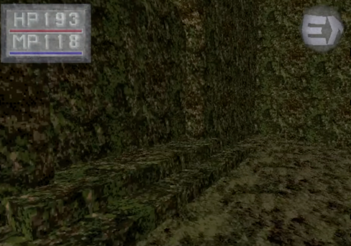
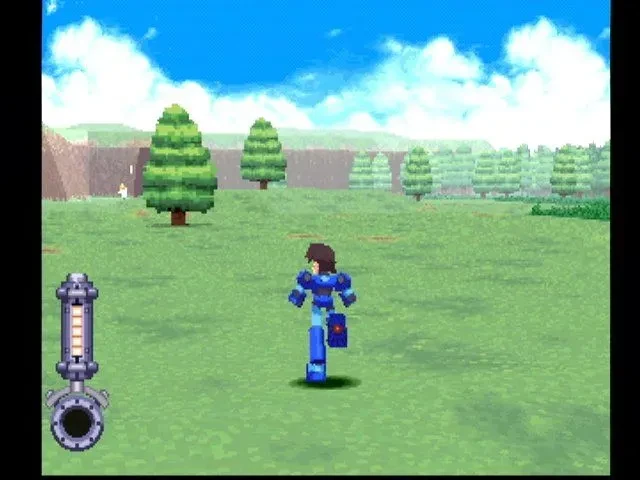

+++
title = "Nostalgia for an Ugly Era in Games"
date = 2024-03-26T11:00:00-07:00
draft = false
categories = ["video games"]
tags = []
+++

I've been watching someone talk about Kings Field for hours on YouTube because they love Dark Souls so much that they're willing to deeply engage with these shitty, unplayable games.

say what you will, but literally nobody is nostalgic for games that looked like this without some kind of severe brain damage:

I was in my primo nostalgic gaming years just when the PS1 came out, and even then I'm hard pressed to gin up nostalgia for early 3D.

well, okay, I can make a few exceptions...

