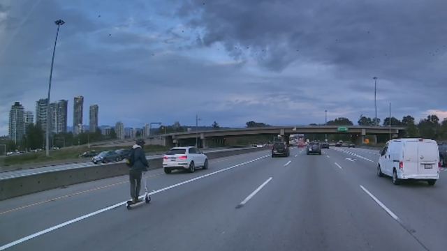

+++
title = "escooters need ambassadors"
date = 2024-09-13T12:00:00-07:00
draft = false
categories = []
tags = ["escooter", "infrastructure"]
+++

I like e-scooters - they're fun, practical, and much easier than a bike to be polite with (at low speeds it’s extremely easy to control and dismount, so the chance of getting in a crash is very low and it’s quite easy to give people loads of space). I also see myself as something of an ambassador for them: look, everyone, it’s absolutely possible to use these things responsibly.

I think that widespread e-scooter use would be, on average, very good: anything that means fewer cars on the road is a significant improvement. Most of the people who hate e-scooters have never tried riding one.

The average person’s opinion (see: reddit, town hall meetings) of e-scooters and e-bikes is quite low, though, because most of them are “teenagers or busy delivery workers given access to a much too powerful lightweight vehicle without any training or licensing”.

Part of that is that scooters really shouldn’t be going higher than 25-30km/h, average bike speeds. That’s tough to regulate, though, because people can claim that they’re not buying them to use on public roads. (Speed limiters, in general, are tough to regulate.)

anyways, "some asshole goes on the highway on a scooter" absolutely does not help

