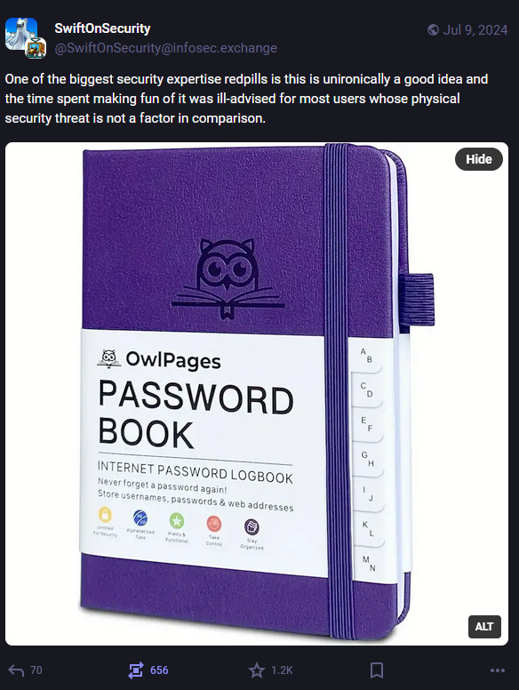

+++
title = "Security Fail"
date = 2024-07-09T12:00:00-07:00
draft = false
categories = ["software"]
tags = ["security", "password manager", "password123"]
+++

look, one of these is legitimately _so much more secure_ than using the same password for everything

it means that somebody who invades your home can steal your identity, but with one password for everything,
someone can steal your identity if they break _any of the sites you've ever visited_.

of course it's _best_ to have 2FA and a password manager, but decades of insistence and my family still is committed
to just the most dogshit passwords, real "Password123" level stuff