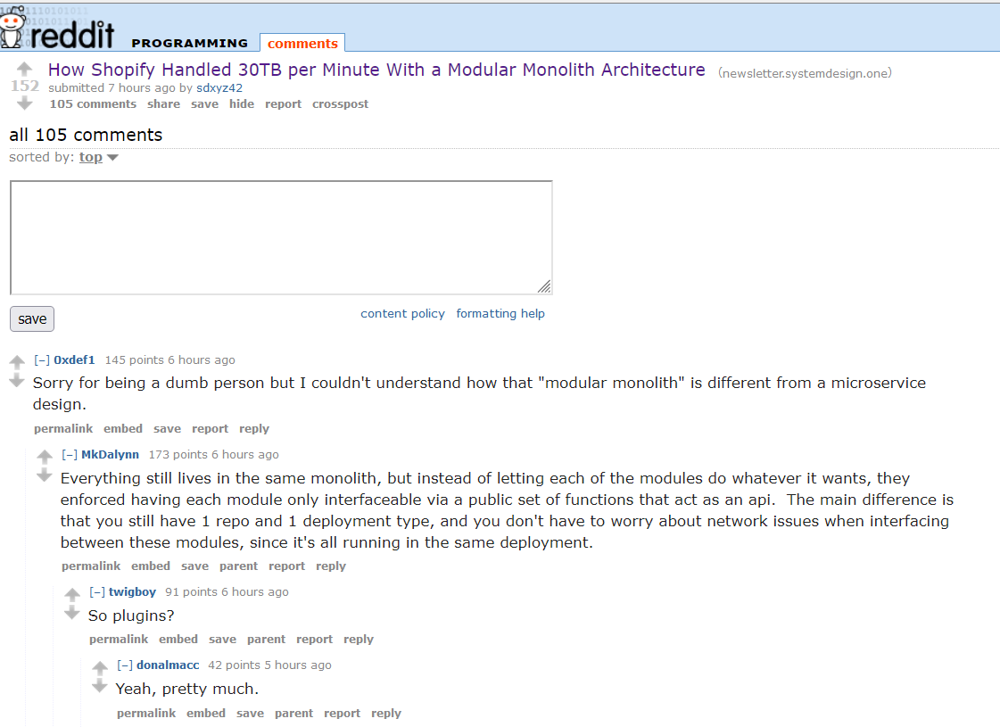

+++
title = "mighty morphin monolith"
date = 2024-12-22T12:00:00-07:00
draft = false
categories = ["software"]
tags = ["architecture", "monolith", "modules"]
+++

so, uh, VRChat's backend is designed similar to this but instead of "Modular Monolith" I called it a "Mighty Morphin' Monolith" which I think we can all agree is many times cooler

