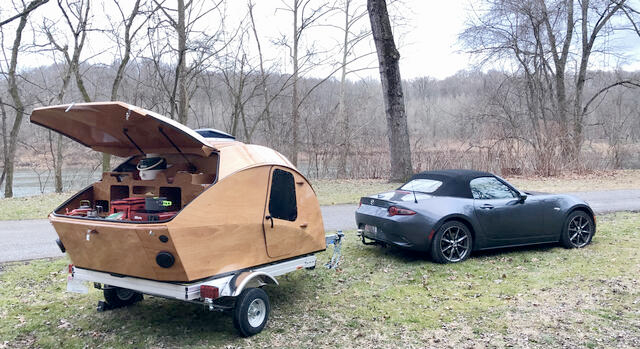

+++
title = "spite tow"
date = 2024-02-22T12:00:00-07:00
draft = false
categories = ["car", "software", "rust"]
tags = ["javascript", "miata"]
+++

**the tow capacity of a Miata is a sternly worded note in the manual saying "no"**

"do not do this, it is an extremely bad idea"

of course, most folks on the internet perceive that as a challenge which is why there are loads of pictures of Miatas towing things, presumably out of spite

------

This might be one of my more controversial opinions, but...

JavaScript doesn't benefit much from having a whole-ass type system bolted on a la TypeScript. It's like attaching a tow-ball hitch to a Miata: just adding the capability doesn't make it practical to _use_. JavaScript is not the right environment for type safety.

If you want byzantine type safety, just program in a language that was designed from the ground up with byzantine type safety in mind, like Rust, or C#, or Scala.